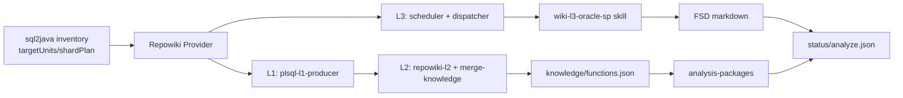

# Repowiki Runtime 目录说明

本目录是 sql2java-workflow 接入 Repowiki Oracle 存储过程 FSD 生成能力时使用的离线 runtime。它不是新的 skill 入口，而是 Provider 在 analyze 阶段调用的本地 CJS 执行层。

## 在 sql2java 中的位置

Provider 入口在 `.opencode/workflow/repowiki-provider.ts`。它会优先把本目录识别为 direct runtime；也兼容 Lingxi 原始布局 `config/skills/repowiki`。

## 输入和输出

| 层级 | 输入 | 输出 | 说明 |
| --- | --- | --- | --- |
| L1 | PL/SQL 源码目录 | `.repowiki/plsql-l1.json` | 源码事实底座，包含 package、subprogram、SQL/table、控制流等抽取结果。 |
| L2 | L1 事实、`profiles/oracle-sp.json` | `.repowiki/knowledge/functions.json` | 面向 FSD 的函数事实集合，Provider 按 `PKG.ref` 消费。 |
| L3 | L2 facts、L3 skill、模板和规约 | `docs/fsd` 或 Provider 注入的 `.workflow-artifacts/<runId>/fsd` | 存储过程 FSD 文档。sql2java 接入时由 `REPOWIKI_L3_DOCS_ROOT` 改写输出根。 |
| Eval | fixtures/golden/manifests | eval 报告 | 用于验证事实抽取、FSD coverage、污染样本和 mutation。 |

## 根目录文件

| 文件 | 作用 |
| --- | --- |
| `SKILL.md` | Repowiki 原 skill 说明和默认执行入口描述。 |
| `SKILL.legacy.md` | 旧版 skill 说明，保留用于对照。 |
| `list-services.cjs` | 从 L1/源码事实中整理服务/候选清单，作为 L2 合并前的输入之一。 |
| `repowiki-l2.cjs` | L2 事实生成主入口，把 L1 和 profile 转换成知识层事实。 |
| `merge-knowledge.cjs` | 合并 L2 输出，生成 `.repowiki/knowledge/functions.json`。 |
| `repowiki-l3-scheduler.cjs` | L3 任务池生成器，按 L2 facts 和 L3 skill manifest 生成 function-doc 任务。 |
| `repowiki-l3-dispatcher.cjs` | L3 worker 调度器，按并发度调用 Lingxi/opencode runner 执行 `wiki-l3-oracle-sp`。 |
| `repowiki-l3-task.cjs` | L3 worker 领取任务、写 draft/done、发布最终文档的任务控制脚本。 |
| `repowiki-run.cjs` | Repowiki 独立运行入口，保留给原 skill 路径使用。 |
| `repowiki-codegraph-init.cjs` | CodeGraph/L1 初始化入口，当前 sql2java 接入优先使用 PL/SQL L1 producer。 |
| `repowiki-export-function-list.cjs` | 导出功能清单的工具入口。 |
| `repowiki-progress.cjs` | 读取 `.repowiki` 状态并输出进度。 |
| `repowiki-stats.cjs` | 统计 Repowiki 产物数量和覆盖情况。 |
| `fsd-acceptance-e2e.cjs` | FSD 端到端验收脚本。 |
| `fsd-facts-eval.cjs` | FSD facts 评价入口。 |
| `fsd-golden-eval.cjs` | 基于 golden 的 FSD 评价入口。 |
| `fsd-markdown-coverage.cjs` | 检查 markdown 是否覆盖事实 token/章节要求。 |
| `fsd-mutation-runner.cjs` | 运行 mutation 用例，验证 gate/eval 是否能识别缺陷。 |
| `fsd-pollution-eval.cjs` | 检查污染样本，避免 FSD 混入无关事实。 |
| `fsd-schema-eval.cjs` | 检查 FSD facts schema 合规性。 |
| `fsd-ab-compare.cjs` | AB 对比工具，用于比较不同 FSD 生成路径。 |
| `plsql-source-facts-corpus.cjs` | 构建/运行 PL/SQL source facts corpus。 |
| `plsql-source-facts-eval.cjs` | 评价 L1/L2 source facts 的 recall/precision。 |
| `l3-worker-prompt.md` | L3 worker 基础提示词。 |
| `L3业务Skill契约.md` | L3 skill manifest、模板、输出根等契约说明。 |
| `repowiki-run-设计文档.md` | 独立 Repowiki run 的设计说明。 |
| `repowiki-l2-修复方案.md` | L2 修复设计记录。 |

## `lib/` 文件

| 文件 | 作用 |
| --- | --- |
| `entry.cjs` | 通用入口/路径辅助。 |
| `plsql-l1-producer.cjs` | Oracle PL/SQL L1 事实生产器，sql2java Provider prepare 的第一步。 |
| `plsql-l1-adapter.cjs` | 将 PL/SQL L1 事实适配到 Repowiki 内部格式。 |
| `l1-adapter.cjs` | 通用 L1 适配层。 |
| `l2-projection.cjs` | 从 L1/L2 facts 投影出文档需要的功能事实。 |
| `l2-callees.cjs` | 解析/整理调用关系和下游 callee。 |
| `l3-skill-contract.cjs` | 读取 L3 skill manifest、模板、能力开关和输出根配置。 |
| `l3-selection.cjs` | L3 任务选择与范围过滤。 |
| `l3-function-list-scopes.cjs` | 功能清单范围计算。 |
| `l3-graph-slice.cjs` | 为 L3 worker 准备局部图/事实切片。 |
| `fsd-facts-schema.cjs` | FSD facts schema 定义。 |
| `fsd-facts-compiler.cjs` | 将 L2 facts 编译为 FSD 可渲染 facts。 |
| `fsd-facts-renderer.cjs` | FSD facts 到 markdown 的确定性渲染辅助。sql2java 当前主线使用 L3 worker 生成文档，不走 Provider 直出。 |
| `fsd-facts-gate.cjs` | FSD facts/markdown 的基础检查。当前接入以 soft 模式作为兜底。 |
| `fsd-facts-coverage.cjs` | 计算 FSD facts 覆盖率。 |
| `fsd-fact-tokens.cjs` | 生成/解析 FSD fact tokens。 |
| `source-facts-repairs.cjs` | source facts 缺口修复票据辅助。 |
| `javadoc.cjs` | JavaDoc/说明文本辅助。 |
| `rows.cjs` | 表格/rows 读写辅助，保留给旧清单工具和兼容路径。 |
| `xlsx.cjs` | Excel 读写辅助，供清单导出场景使用。 |

## 子目录

| 目录 | 作用 |
| --- | --- |
| `profiles/` | 不同业务线 profile。sql2java Oracle 存过路径使用 `oracle-sp.json`。 |
| `templates/` | Repowiki 默认清单和文档模板。Oracle 存过 L3 主要读取 `wiki-l3-oracle-sp/templates`。 |
| `eval/` | 验收、golden、mutation、GitHub corpus、source facts 评测数据。 |
| `tests/` | Repowiki runtime 自身的 CJS 测试。 |
| `vendor/` | Repowiki runtime 自带的离线依赖，例如 PL/SQL parser、ANTLR、TypeScript。 |

## Lingxi skill 镜像

仓库同时打包 `vendor/lingxicode-runtime/config/skills/repowiki` 和 `vendor/lingxicode-runtime/config/skills/wiki-l3-oracle-sp`：

- `repowiki` 镜像用于兼容原 Lingxi skill 布局。
- `wiki-l3-oracle-sp` 是当前 L3 worker 真正读取的 Oracle 存过 FSD skill，包含 `SKILL.md`、`manifest.json`、`validation.json`、`rules/`、`templates/功能文档.md`。

Provider 会把 `REPOWIKI_L3_DOCS_ROOT` 注入为 `.workflow-artifacts/<runId>`，因此 L3 文档最终进入 sql2java 的 `fsd/` artifact 目录，而不是写回源码目录。
