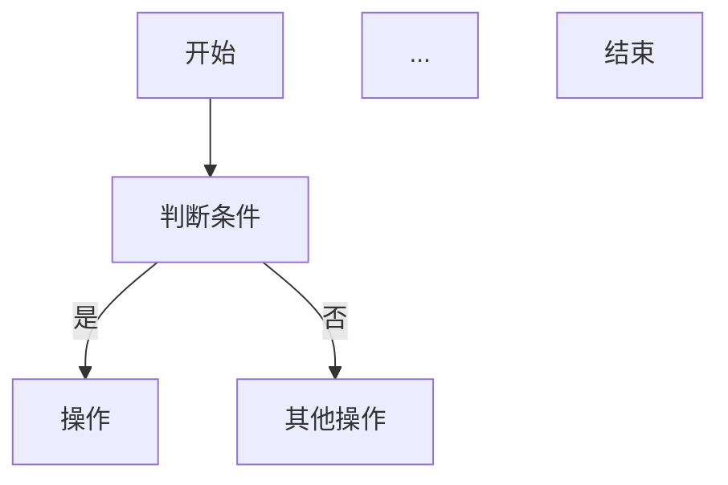

# FSD 生成规约（6 板块功能规格说明）

本规约用于 Repowiki L3 Oracle 存过 FSD（Functional Specification Document，功能规格说明文档）的字段、模板和渲染规则。FSD 的目标是**支持 Java/MyBatis 迁移**，必须完整对齐 `sp-to-fsd-design.md` 样例的 6 板块深度（每板块多个二级子节）。

生成时必须与 `templates/功能文档.md` 保持一致，不得增减章节与子节。

## 章节强制要求

功能文档必须严格包含以下 6 个二级章节（顺序固定，不带编号）：
- 概览
- 表结构映射
- 依赖分析
- 业务规则
- 控制流与异常
- 特殊语法转化规约

不得增减章节，不得使用编号标题（如 `## 1. 概览`），通用校验会拒绝编号标题。

---

## 板块1：概览

### 1.1 存储过程功能

**必填表格**（5 行，全部必填）：

| 属性 | 值 |
|------|------|
| 子程序名 | {method} |
| 类型 | {procedure_type: PROCEDURE/FUNCTION} |
| 所属包 | {package_name}；独立函数填 `__STANDALONE__` |
| 功能摘要 | {一句话中文摘要，含关键技术点} |
| 翻译策略 | {迁移到 Java/MyBatis 的等价方案，按命中 killer 归纳} |

### 1.2 参数清单与 Java 类型映射

**必填表格**，列：`参数名 | 方向 | Oracle 类型 | Java 类型 | 说明`

Java 类型来自 L2 `oracle_params[].java_type`（已按精度判定 BigDecimal/Long/String）。

**返回值**（Function 才有，独立子节）：
- Oracle: `{return_type}` → Java: `{java_type}`

### 1.3 转换策略（5 项分解，必填）

| 项 | 内容 |
|---|---|
| 服务映射 | {sp_xxx → XxxService.spXxx()} |
| 参数封装 | 入参数量 → 独立参数 or DTO |
| 返回类型 | Oracle 返回类型 → Java 类型；OUT 参数 → DTO |
| 设计模式 | Service / Util / Batch Executor / ... |
| 异常处理 | 全局 @Transactional(rollbackFor) / 局部 try-catch / RAISE → 抛出 |

**翻译策略**归纳规则（基于命中的 killer 集合）：
- 命中 FORALL_SAVE_EXCEPTIONS + MERGE → "MyBatis batch executor + 异常收集 + insertOrUpdate"
- 命中 EXECUTE_IMMEDIATE → "JdbcTemplate 动态 SQL"
- 命中 PRAGMA_AUTONOMOUS_TRANSACTION → "Spring REQUIRES_NEW 事务"
- 命中 DBMS_SCHEDULER → "@Scheduled 定时任务"
- 无命中 killer → "标准 MyBatis Mapper + Service 调用"

### 1.4 签名

```sql
{signature 字段原文，原样输出}
```

签名直接用 L2 `signature` 字段，**不得**用 `entry` 字段。

### 1.5 输入类型定义

来自 L2 `input_types`（RECORD/TABLE OF）。无则写"无"。

---

## 板块2：表结构映射

### 2.1 涉及的表清单

**必填表格**，列：`表名 | 操作类型 | DO 类名 | 说明`

- 操作类型：SELECT / INSERT / UPDATE / DELETE / MERGE
- DO 类名：`{Table}DO`（按表名 snake_case → PascalCase + DO 后缀）
- 无表操作时写"本子程序不涉及表操作"

### 2.2 列 → DO 字段映射（每张表一节，必填）

每张涉及到的表，按以下格式输出一张完整表格：

#### {TABLE_NAME} 表 → {Table}DO

| 列名 | Oracle 类型 | Java 类型 | Java 字段名 | 可空 | 主键 | 本 SP 使用 |
|------|------------|----------|------------|------|------|-----------|
| {列名} | {oracle_type} | {java_type} | {camelCase} | N/Y | Y/空 | ✓/— |

- 列定义来自 L2 `table_facts[i].columns`（已从 plsql-l1.json 内联）
- Java 类型按 `转化映射规则.md` 的精度映射（`number(p,s)` s>0 或 p>10 → BigDecimal；`varchar2(size)` 保留尺寸；`date`/`timestamp` → LocalDateTime）
- Java 字段名：snake_case → camelCase（如 `lot_id` → `lotId`，`qty_on_hand` → `qtyOnHand`）
- 本 SP 使用：✓ 或 —（依据 L2 table_facts 的列引用事实）

### 2.3 跨表关系

**必填表格**，列：`关系 | 类型 | 说明`

- 关系：`{子表}.{外键列} → {父表}.{主键列}`
- 类型：主从 / 外键 / 反向引用 / JOIN
- 无跨表关系时保留一行：`| （无） | — | — |`

### 2.4 特殊列处理

**必填表格**，列：`表.列 | 特殊类型 | 处理方式`

特殊类型枚举：
- AUTO_INCREMENT → MyBatis `useGeneratedKeys=true`
- DEFAULT SYSDATE → Java 传入 `LocalDateTime.now()`
- DEFAULT SEQ_X.NEXTVAL → useGeneratedKeys + KeyHolder 或 @SequenceGenerator
- LOB → Blob/Clob 处理
- 虚拟列 → 不写入 Java 字段
- DECIMAL_PERCENT → 计算时需 /100

无特殊列时保留一行：`| （无） | — | — |`

---

## 板块3：依赖分析

### 3.1 调用的其他子程序

**必填表格**，列：`Oracle 调用 | 目标包 | 目标子程序 (refName) | 功能`

来自 L2 `cross_package_calls`。

- `refName` 必须与文件名一致（重载时 `{name}__{seq}`）
- 无外部调用时保留一行：`| （无） | — | — | — |`

### 3.2 被其他子程序调用

**必填表格**，列：`调用方 | 入口`

- 来自 L2 `downstream.json` 反向查询：谁调用了本子程序
- 暂未发现时填"（待其他 SP 分析后补充）"

### 3.3 跨包调用 → Service 注入

**必填表格**，列：`字段 | 类型 | 来源包 | 用途`

- 字段名：`{targetPkg}Service`（如 `util_pkg` → `utilService`）
- 类型：`{Pkg}Service`（PascalCase）
- 来源包：oracle 包名
- 用途：跨包调用的具体场景

无跨包调用时保留一行：`| （无） | — | — | — |`

### 3.4 序列依赖

来自 L2 `sequence_deps`，列：`序列名 | 用途`。无则写"无"。

### 3.5 常量依赖

来自 L2 `constant_deps`，列：`常量名 | 所属包 | 值 | 用途`。

- 常量值来自 L2 跨包抽取（如 const_pkg 的 `c_default_currency='USD'`）
- 未抽取到值时填"需人工复核（L2 未抽取到值）"，但需给出所属包路径便于人工补全
- **注意**：L2 已过滤 SQL 别名（h/ci/r/t/old/new 等超短名不应出现于此

---

## 板块4：业务规则（必须 4 类分表，不得省略）

业务规则是 FSD 的核心。必须按以下 4 个子节分类列出，不得合并为单一列表。

### 4.1 校验规则

| 规则 ID | 类别 | 描述 | Oracle 位置 | Java 实现 |
|---------|------|------|------------|----------|

- 类别：参数校验 / 状态校验 / 唯一性校验 / 存在性校验 / 库存校验
- 至少列出主流程校验；纯逻辑函数（无校验）保留一行 `| （无） | — | — | — | — |`

### 4.2 计算逻辑

| 逻辑 ID | 描述 | Oracle 表达式 | Java 实现 |
|---------|------|-------------|----------|

- 涉及金额/数量计算必须列出
- 无计算逻辑保留一行 `| （无） | — | — | — |`

### 4.3 状态流转

状态流转图 + 流转表：

```
{状态A} → [触发条件] → {状态B}
```

| 转换 | 条件 | 操作 |
|------|------|------|

- 无状态流转保留一行 `| （无） | — | — |`

### 4.4 边界条件

| 条件 | 处理方式 | Oracle 行为 | Java 映射 |
|------|---------|------------|----------|

- 必须考虑：空值 / 零值 / 溢出 / 并发
- 无边界条件保留一行 `| （无） | — | — | — |`

---

## 板块5：控制流与异常

### 5.1 流程图（mermaid）

**复杂子程序**（分支 > 3 或含循环或含异常处理）必须产出 mermaid 图：



**简单子程序**（分支 ≤ 3 且无循环）允许用文字描述替代 mermaid：

> 本子程序为简单逻辑：① 校验入参非空 → ② 执行 XX 操作 → ③ 返回结果。

### 5.2 分支逻辑

**必填表格**（复杂子程序），列：`分支 ID | 条件 | 真分支 | 假分支 | Oracle 行号`

- 来自 L2 `control_flow` 的 IF/ELSIF/ELSE/CASE 结构
- 简单子程序保留一行 `| （无） | — | — | — | — |`

### 5.3 循环结构

**必填表格**，列：`循环 ID | 类型 | Oracle 构造 | Java 映射 | 退出条件`

- 类型：游标循环 / FOR i / WHILE / FORALL
- 来自 L2 `control_flow` 的 FOR/LOOP/CURSOR 结构
- 简单子程序无循环时保留一行 `| （无） | — | — | — | — |`

### 5.4 异常处理

**必填表格**，列：`异常 | Oracle 处理 | Java 映射 | 处理方式`

- 来自 L2 `exception_handlers`
- `**Java 等价**列必须给出迁移建议`
- 无异常处理保留一行 `| （无） | — | — | — |`

---

## 板块6：特殊语法转化规约

### 6.1 转化映射（必填，FSD 核心）

| Oracle 构造 | 位置 | Java/MyBatis 等价 | 风险 |
|------------|------|-------------------|------|

- 来自 L2 `special_syntax`，**必须 join `转化映射规则.md`** 给出 Java/MyBatis 等价方案
- 位置列填 `special_syntax[].line`（文件绝对行）
- 风险列填 `high` / `medium` / `low`
- 无特殊语法保留一行 `| （无） | — | — | — |`

### 6.2 事务边界（必填）

说明：
- 显式 COMMIT/ROLLBACK 的位置和场景
- PRAGMA AUTONOMOUS_TRANSACTION 的独立事务边界
- 无显式事务控制时标注"由调用方控制事务"
- Spring 等价：@Transactional 的适用性（propagation / rollbackFor）

### 6.3 需手动审查的构造（必填，FSD 板块6 固定收尾）

| 构造 | 位置 | 原因 | 建议 |
|------|------|------|------|

- 对 `special_syntax` 中 risk=high 和 risk=medium 的构造，必须给出迁移建议
- risk=low 的可省略
- 无需审查的构造保留一行 `| （无） | — | — | — |`（**禁止省略此表**）

---

## 渲染规则

1. **签名**：用 L2 `signature` 字段，放入 ```sql 代码块，原样输出
2. **mermaid 图**：用 ```mermaid 代码块，flowchart TD 格式
3. **表格**：标准 markdown 表格，不得用 HTML
4. **业务规则**：4 类分表，每类独立子节
5. **缺失值**：事实无法支撑时写"无"，但 业务规则 / 转化映射 / Service 注入 不得写"无"而应保留 `（无）` 占位行
6. **章节标题**：不带编号前缀（通用校验拒绝编号标题如 `## 1. 概览`）
7. **Java 字段名**：snake_case → camelCase 查表（`转化映射规则.md`），非 LLM 自由发挥
8. **DO 类名**：`{Table}DO`，按表名 PascalCase + DO 后缀
9. **Service 注入字段名**：`{targetPkg}Service`，按来源包 camelCase + Service 后缀
