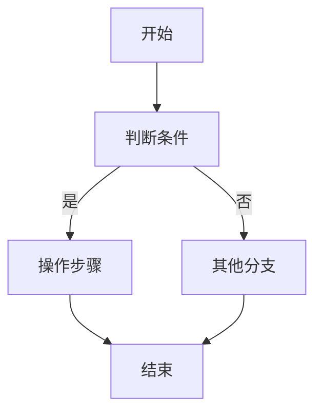

# {PKG}.{subprogram} — 功能规格说明（FSD）

## 概览

### 存储过程功能

| 属性 | 值 |
|------|------|
| 子程序名 | {method} |
| 类型 | {procedure_type: PROCEDURE/FUNCTION} |
| 所属包 | {package_name}；独立函数填 `__STANDALONE__` |
| 功能摘要 | {一句话中文摘要，含关键技术点} |
| 翻译策略 | {迁移到 Java/MyBatis 的等价方案，按命中 killer 归纳} |

### 参数清单与 Java 类型映射

| 参数名 | 方向 | Oracle 类型 | Java 类型 | 说明 |
|--------|------|------------|-----------|------|
| {参数名} | {IN/OUT/IN OUT} | {oracle_type} | {java_type} | {说明} |

**返回值**（Function 才有）：
- Oracle: `{return_type}` → Java: `{java_type}`

### 转换策略

| 项 | 内容 |
|---|---|
| 服务映射 | {sp_xxx → XxxService.spXxx()} |
| 参数封装 | 入参数量 → 独立参数 or DTO |
| 返回类型 | Oracle 返回类型 → Java 类型；OUT 参数 → DTO |
| 设计模式 | Service / Util / Batch Executor / ... |
| 异常处理 | 全局 @Transactional(rollbackFor) / 局部 try-catch / RAISE → 抛出 |

### 签名

```sql
{signature 字段原文，原样输出}
```

### 输入类型定义

{RECORD/TABLE OF 类型定义，无则写"无"}

## 表结构映射

### 涉及的表清单

| 表名 | 操作类型 | DO 类名 | 说明 |
|------|---------|---------|------|
| {TABLE_NAME} | {SELECT/INSERT/UPDATE/DELETE/MERGE} | {Table}DO | {说明} |

无表操作时写："本子程序不涉及表操作"

### 列 → DO 字段映射

#### {TABLE_NAME} 表 → {Table}DO

| 列名 | Oracle 类型 | Java 类型 | Java 字段名 | 可空 | 主键 | 本 SP 使用 |
|------|------------|----------|------------|------|------|-----------|
| {列名} | {oracle_type} | {java_type} | {camelCase} | N/Y | Y/空 | ✓/— |

> 每张涉及到的表一张子表，按表名分组

### 跨表关系

| 关系 | 类型 | 说明 |
|------|------|------|
| {子表}.{外键列} → {父表}.{主键列} | 主从/外键/反向引用/JOIN | {说明} |

无跨表关系时保留一行：`| （无） | — | — |`

### 特殊列处理

| 表.列 | 特殊类型 | 处理方式 |
|-------|---------|---------|
| {表.列} | {AUTO_INCREMENT/DEFAULT SYSDATE/DEFAULT SEQ_X.NEXTVAL/LOB/虚拟列/DECIMAL_PERCENT} | {处理方式} |

无特殊列时保留一行：`| （无） | — | — |`

## 依赖分析

### 调用的其他子程序

| Oracle 调用 | 目标包 | 目标子程序 (refName) | 功能 |
|------------|--------|---------------------|------|
| {调用语句} | {目标包} | {目标成员} | {功能说明} |

无外部调用时保留一行：`| （无） | — | — | — |`

### 被其他子程序调用

| 调用方 | 入口 |
|--------|------|
| {调用方包.方法} | {入口标识} |

暂未发现时填："（待其他 SP 分析后补充）"

### 跨包调用 → Service 注入

| 字段 | 类型 | 来源包 | 用途 |
|------|------|--------|------|
| {targetPkg}Service | {Pkg}Service | {oracle 包名} | {跨包调用场景} |

无跨包调用时保留一行：`| （无） | — | — | — |`

### 序列依赖

| 序列名 | 用途 |
|--------|------|
| {序列名} | {用途} |

无则写"无"。

### 常量依赖

| 常量名 | 所属包 | 值 | 用途 |
|--------|--------|-----|------|
| {常量名} | {所属包} | {值} | {用途} |

未抽取到值时填"需人工复核（L2 未抽取到值）"

## 业务规则

### 校验规则

| 规则 ID | 类别 | 描述 | Oracle 位置 | Java 实现 |
|---------|------|------|------------|----------|
| VAL-001 | 参数校验/状态校验/唯一性校验/存在性校验/库存校验 | {描述} | line {行号} | {Java 实现} |

纯逻辑函数保留一行：`| （无） | — | — | — | — |`

### 计算逻辑

| 逻辑 ID | 描述 | Oracle 表达式 | Java 实现 |
|---------|------|-------------|----------|
| CALC-001 | {描述} | {Oracle 表达式} | {Java 实现} |

无计算逻辑保留一行：`| （无） | — | — | — |`

### 状态流转

```
{状态A} → [触发条件] → {状态B}
```

| 转换 | 条件 | 操作 |
|------|------|------|
| → {状态} | {条件} | {SQL 操作} |

无状态流转保留一行：`| （无） | — | — |`

### 边界条件

| 条件 | 处理方式 | Oracle 行为 | Java 映射 |
|------|---------|------------|----------|
| {空值/零值/溢出/并发} | {处理方式} | {Oracle 行为} | {Java 映射} |

无边界条件保留一行：`| （无） | — | — | — |`

## 控制流与异常

### 流程图

复杂子程序（分支 > 3 或含循环或含异常处理）：



简单子程序（分支 ≤ 3 且无循环）允许文字描述：

> 本子程序为简单逻辑：① {步骤1} → ② {步骤2} → ③ {返回结果}

### 分支逻辑

| 分支 ID | 条件 | 真分支 | 假分支 | Oracle 行号 |
|---------|------|--------|--------|------------|
| BR-001 | {条件} | {真分支操作} | {假分支操作} | line {行号} |

简单子程序保留一行：`| （无） | — | — | — | — |`

### 循环结构

| 循环 ID | 类型 | Oracle 构造 | Java 映射 | 退出条件 |
|---------|------|------------|----------|---------|
| LOOP-001 | 游标循环/FOR i/WHILE/FORALL | {Oracle 构造} | {Java 映射} | {退出条件} |

无循环时保留一行：`| （无） | — | — | — | — |`

### 异常处理

| 异常 | Oracle 处理 | Java 映射 | 处理方式 |
|------|------------|----------|---------|
| {异常类型} | {Oracle 处理} | {Java 等价} | {处理方式} |

无异常处理保留一行：`| （无） | — | — | — |`

## 特殊语法转化规约

### 转化映射

| Oracle 构造 | 位置 | Java/MyBatis 等价 | 风险 |
|------------|------|-------------------|------|
| {Oracle 构造} | {行号} | {Java/MyBatis 等价} | {高/中/低} |

无特殊语法保留一行：`| （无） | — | — | — |`

### 事务边界

- 显式 COMMIT/ROLLBACK 的位置和场景：{说明}
- PRAGMA AUTONOMOUS_TRANSACTION 的独立事务边界：{说明}
- 无显式事务控制时标注："由调用方控制事务"
- Spring 等价：@Transactional 的适用性（propagation / rollbackFor）

### 需手动审查的构造

| 构造 | 位置 | 原因 | 建议 |
|------|------|------|------|
| {构造} | {行号} | {审查原因} | {迁移建议} |

对 risk=high 和 risk=medium 的构造必须给出迁移建议；无需审查的构造保留一行：`| （无） | — | — | — |`
