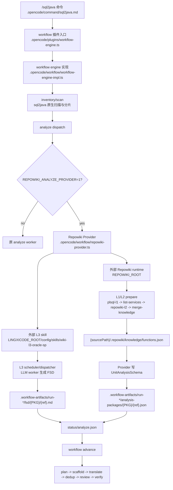

# sql2java-workflow

## Repowiki Oracle 存过 FSD 接入版

本仓库是在 `sql2java-workflow` 现有工作流上接入 Repowiki Oracle 存储过程 FSD 生成能力的版本。仓库只保存接入代码、命令约定、测试和文档；不提交 Lingxi runtime、模型配置、`.exe`、运行日志或 `.repowiki` 运行产物。

当前边界：

- 保留 `sql2java` 的 `inventory/scan`，继续用它生成 `targetUnits`、`shardPlan`、`packages/*.json`、`subprograms/*.json`，支撑后续 workflow 调度。
- 在 `analyze` 阶段启用 Repowiki Provider，调用外部已有 Repowiki L1/L2/L3 runtime。
- Repowiki L1/L2 每个 workflow run 准备一次，生成 `{sourcePath}/.repowiki/knowledge/functions.json`。
- Repowiki L3 使用外部 Lingxi 根目录中的 `wiki-l3-oracle-sp` skill 生成 FSD，并写入 sql2java 原协议目录 `.workflow-artifacts/<runId>/fsd`。
- Provider 将 Repowiki L2 facts 映射成 sql2java 的 `analysis-packages/{PKG}/{ref}.json`，让后续 `plan/scaffold/translate` 继续消费原协议。

### 整体架构



### 接入点

| 接入点 | 文件 | 作用 |
| --- | --- | --- |
| 命令入口 | `.opencode/command/sql2java.md` | 定义 `/sql2java` 的参数解析、执行循环和 Provider fast path：当 Provider 返回 `nextAction=advance` 时不再派发原 analyze worker，而是直接进入 `advance`。 |
| 插件入口 | `.opencode/plugins/workflow-engine.ts` | 薄入口，只导出 `WorkflowEnginePlugin`，避免插件加载时误执行 helper。 |
| Workflow 主实现 | `.opencode/workflow/workflow-engine-impl.ts` | 在 `dispatch` 的 analyze 分片路径里调用 `runRepowikiAnalyzeProviderForDispatch()`。 |
| Provider | `.opencode/workflow/repowiki-provider.ts` | 适配层。负责定位外部 Repowiki runtime、执行 L1/L2 prepare、执行 L3 scheduler/dispatcher、写回 sql2java artifacts。 |
| 外部 Repowiki runtime | `REPOWIKI_ROOT` | 指向已有 `config/skills/repowiki` 或独立 Repowiki runtime 目录。 |
| 外部 Lingxi runtime | `LINGXICODE_ROOT` / `REPOWIKI_L3_RUNNER` | 提供 `wiki-l3-oracle-sp` skill、opencode/lingxicode runner、内置 Node。 |

### 数据流和产物

| 阶段 | 输入 | 输出 | 下游如何使用 |
| --- | --- | --- | --- |
| sql2java scan/inventory | PL/SQL 源码目录、可选 `--header/--body/--mainEntry` | `inventory.json`、`packages/*.json`、`subprograms/*.json`、`tables/*.json`、`shardPlan/targetUnits` | 决定 analyze/translate 分片边界，Provider 只处理当前分片的 `targetUnits`。 |
| Repowiki L1 | 同一份 PL/SQL 源码目录 | `{sourcePath}/.repowiki/plsql-l1.json` 等 L1 事实 | 作为 L2 的事实输入。 |
| Repowiki L2 | L1 事实、profile `oracle-sp` | `{sourcePath}/.repowiki/knowledge/functions.json` | Provider 按 `PKG.ref` 匹配当前 target unit，生成 `analysis-packages`。 |
| Repowiki L3 | L2 facts、`wiki-l3-oracle-sp` skill、FSD 模板/规约 | `.workflow-artifacts/<runId>/fsd/{PKG}/{ref}.md` | 后续 `translate` 按原 sql2java 协议读取 FSD。 |
| Provider publish | L2 facts、L3 FSD、当前分片 `targetUnits` | `analysis-packages/{PKG}/{ref}.json`、`fsd/{PKG}/{ref}.md`、`status/analyze.json` | `workflow advance` 校验 analyze 分片完成；全量 run 会继续进入 `plan/scaffold/translate`。 |

### 新增文件范围

接入实现新增文件应收敛在 `.opencode` 下；仓库根和 `tests` 只保存说明与验证资产。

```text
sql2java-workflow-repowiki/
├── .opencode/
│   ├── command/sql2java.md                  # /sql2java 编排命令，识别 Provider fast path
│   ├── plugins/workflow-engine.ts           # opencode 插件入口
│   └── workflow/
│       ├── workflow-engine-impl.ts          # workflow 状态机与 dispatch 主实现
│       └── repowiki-provider.ts             # Repowiki 接入适配层
├── README.md                                # 接入说明、数据流、外部 runtime 配置说明
└── tests/ts/unit/*repowiki*.test.ts         # Provider/contract/dispatcher 单元测试
```

不提交：

- `vendor/lingxicode-runtime/**`
- `vendor/repowiki-runtime/**`
- `config/opencode*.json` 等本地模型配置
- `*.exe`
- `.workflow-artifacts/**`
- `{sourcePath}/.repowiki/**`

### 外部运行依赖

运行前需要准备一个已有 Lingxi 离线根目录，或从项目组制品库下载等价 runtime。该目录需要包含：

```text
lingxicode-offline-v1.4.6-win10-x64-skills/
├── lingxicode.bat
├── bin/opencode.exe
├── config/
│   ├── opencode.json                       # 本地自行配置，不提交到本仓库
│   ├── bin/codegraph/node.exe
│   └── skills/
│       ├── repowiki/
│       └── wiki-l3-oracle-sp/
```

下载/准备方式：

| 方式 | 说明 |
| --- | --- |
| 行内/项目组离线包 | 使用已发布的 `lingxicode-offline-v1.4.6-win10-x64-skills`，把路径配置到 `LINGXICODE_ROOT`。 |
| 项目组制品库 | 如果维护 `lingxicode-runtime-win10-x64.zip`，下载后解压到本机任意目录，再配置 `LINGXICODE_ROOT`。 |
| GitHub Release | 如果仓库 Release 提供 runtime 资产，可在 [Releases](https://github.com/lanszdg/sql2java-workflow-repowiki/releases) 下载；当前源码仓库不内置二进制。 |

模型配置不要提交到本仓库。外部 `LINGXICODE_ROOT/config/opencode.json` 中的 key 建议使用环境变量占位：

```json
{
  "provider": {
    "enterprise-llm": {
      "options": {
        "baseURL": "https://dashscope.aliyuncs.com/compatible-mode/v1",
        "apiKey": "{env:DASHSCOPE_API_KEY}"
      }
    }
  }
}
```

### 运行方式

```powershell
$env:LINGXICODE_ROOT = "D:\path\to\lingxicode-offline-v1.4.6-win10-x64-skills"
$env:REPOWIKI_ROOT = "$env:LINGXICODE_ROOT\config\skills\repowiki"
$env:REPOWIKI_NODE_PATH = "$env:LINGXICODE_ROOT\config\bin\codegraph\node.exe"
$env:REPOWIKI_L3_RUNNER = "$env:LINGXICODE_ROOT\lingxicode.bat"

$env:DASHSCOPE_API_KEY = "<内网/行内模型网关 key>"
$env:REPOWIKI_ANALYZE_PROVIDER = "1"
$env:REPOWIKI_AUTO_PREPARE = "1"
$env:REPOWIKI_PROFILE = "oracle-sp"

& "$env:LINGXICODE_ROOT\lingxicode.bat" --print-logs --log-level WARN run --command sql2java -- resources\mfg_erp_sql_tiny
```

只验证 `inventory,analyze`：

```powershell
& "$env:LINGXICODE_ROOT\lingxicode.bat" --print-logs --log-level WARN run --command sql2java -- --phases inventory,analyze resources\mfg_erp_sql_tiny
```

注意：`--phases inventory,analyze` 是局部 smoke，只证明前两阶段。完整端到端必须不加 `--phases`，或显式覆盖 `plan,scaffold,translate,dedup,review,verify` 的后续验证。

### Repowiki 运行时文件职责

这些文件来自外部 `REPOWIKI_ROOT`，本仓库只通过 Provider 调用它们：

| 文件/目录 | 作用 | 本接入链路是否使用 |
| --- | --- | --- |
| `lib/plsql-l1-producer.cjs` | L1 入口，扫描 Oracle PL/SQL 源码并生成 `.repowiki/plsql-l1.json` 等源码事实。 | 是，Provider prepare 第一步。 |
| `list-services.cjs` | 基于 L1/profile 生成候选清单和 L2 前置输入。 | 是，Provider prepare 第二步。 |
| `repowiki-l2.cjs` | L2 主入口，将 L1 事实转换为面向 FSD 的函数事实。 | 是，Provider prepare 第三步。 |
| `merge-knowledge.cjs` | 合并 L2 分片产物，生成 `.repowiki/knowledge/functions.json`。 | 是，Provider prepare 第四步。 |
| `repowiki-l3-scheduler.cjs` | 根据 L2 facts 和 `wiki-l3-oracle-sp` skill contract 生成 L3 function-doc 任务池。 | 是，Provider L3 第一步。 |
| `repowiki-l3-dispatcher.cjs` | 滚动派发 L3 worker，通过 `REPOWIKI_L3_RUNNER` 执行业务 skill。 | 是，Provider L3 第二步。 |
| `repowiki-l3-task.cjs` | L3 worker 的 claim/done/fail 控制脚本。 | 是，由 L3 worker 间接调用。 |
| `profiles/oracle-sp.json` | Oracle 存储过程 profile，约束 L2 事实类型和业务目标。 | 是，默认 `REPOWIKI_PROFILE=oracle-sp`。 |
| `lib/l3-skill-contract.cjs` | 读取 L3 skill manifest、模板、输出根和校验配置。 | 是，L3 scheduler/worker 使用。 |
| `lib/l3-graph-slice.cjs` | 为 L3 worker 准备局部事实切片。 | 是，L3 worker 使用。 |
| `lib/fsd-facts-*.cjs` | FSD facts 编译、coverage、gate、token、renderer 辅助。 | L3/gate/eval 使用；Provider 不走 renderer 直出替代 L3。 |
| `eval/`、`tests/` | source facts、FSD coverage、mutation、golden 测试资产。 | 验收和回归使用。 |

`wiki-l3-oracle-sp` skill 来自外部 `LINGXICODE_ROOT/config/skills/wiki-l3-oracle-sp`：

| 文件/目录 | 作用 |
| --- | --- |
| `SKILL.md` | Oracle 存过 FSD L3 worker 的业务规约。 |
| `manifest.json` | L3 skill manifest，声明 kind、输出根环境变量 `REPOWIKI_L3_DOCS_ROOT` 等契约。 |
| `validation.json` | L3 文档基础校验配置。 |
| `selection-policy.json` | L3 任务选择策略。 |
| `rules/` | 行内 Oracle 存过 FSD 规则材料。 |
| `templates/功能文档.md` | L3 生成 FSD 的业务模板。 |

### Repowiki 运行时状态文件

| 产物 | 位置 | 说明 |
| --- | --- | --- |
| L1/L2 源码事实 | `{sourcePath}/.repowiki/` | Repowiki prepare 写在被分析项目目录下，供 L2/L3 复用。 |
| L2 汇总 facts | `{sourcePath}/.repowiki/knowledge/functions.json` | Provider 按 `PKG.ref` 匹配当前 sql2java target unit。 |
| L3 任务池 | `{sourcePath}/.repowiki/l3-*` | scheduler/dispatcher 的任务、状态和 worker 过程文件。 |
| FSD 文档 | `.workflow-artifacts/<runId>/fsd/{PKG}/{ref}.md` | Provider 注入 `REPOWIKI_L3_DOCS_ROOT=<artifactsDir>` 后，L3 文档写入 sql2java artifact 目录。 |
| analyze 状态 | `.workflow-artifacts/<runId>/status/analyze.json` | Provider 收口 analyze，使 workflow 可以继续 advance 到后续阶段。 |

基于 AI Agent 的 Oracle PL/SQL → Spring Boot + MyBatis 端到端转译系统。采用确定性状态机驱动的单流水线工作流，以严格 1:1 忠实转换为原则，将 PL/SQL 代码翻译为可编译的 Java 应用。

## 架构概览

```
/sql2java <path>
  │
  ▼
┌──────────────────────────────────────────────────┐
│  .opencode/command/sql2java.md                    │
│  参数解析 → 路由分发 → workflow 工具调用            │
└──────────────────┬───────────────────────────────┘
                   │
                   ▼
┌──────────────────────────────────────────────────┐
│  Schema 预获取（可选，有 db.properties 时触发）      │
│  schema-fetcher.ts → pg 驱动（PostgreSQL/GaussDB） │
│  产出：ddl-output/ + DDL 文件                      │
└──────────────────┬───────────────────────────────┘
                   │
                   ▼
  inventory（第 0 步 scan：确定性预扫描，零 LLM，产出 inventory-index.json）
  → analyze → plan（人工确认）→ scaffold → translate → dedup → review → verify → 完成
                                                ↑       │             │            │
                                                │       │             ↓ (failed)   ↓ (failed)
                                                │       │             fix ←────────┘
                                                │       │             │
                                                └───────┘             └→ fix → review（增量回到触发阶段）
```

**单流水线**：8 个阶段 + 1 个条件分支阶段（fix），一个 runId，无条件前进 + review/verify 失败时进入 fix 循环（增量重做）。fix 完成后直接回到 review 审查，dedup 只在主线 translate 后执行一次。启动前可选执行 Schema 预获取（发现 `db.properties` 时自动连接 PostgreSQL/GaussDB 拉取 DDL）。

## 项目结构

```
sql2java-workflow/
├── .opencode/                        # opencode 框架插件目录
│   ├── command/
│   │   └── sql2java.md               # /sql2java 命令入口
│   ├── agent/
│   │   ├── sql-analyst.md            # inventory + analyze 阶段
│   │   ├── java-architect.md         # plan + scaffold + dedup 阶段
│   │   ├── translator.md             # translate + fix 阶段
│   │   └── reviewer.md               # review + verify 阶段
│   ├── docs/
│   │   └── java-code-spec.md         # 统一 Java 代码规约（自动注入 3 个 agent，支持 --spec 覆盖）
│   ├── workflow/
│   │   ├── engine-core.ts            # 状态机核心
│   │   ├── workflow-definitions.ts   # 工作流定义 + TransitionRule + PHASE_PREREQUISITES
│   │   ├── artifact-schemas.ts       # Artifact Zod Schemas + getArtifactFilename + getPerPackageSchema
│   │   ├── plsql-scanner.ts          # PL/SQL AST/regex 预扫描器
│   │   ├── schema-fetcher.ts         # 数据库 Schema 自动获取（db.properties → ddl-output/，PG/GaussDB）
│   │   ├── refname.ts                # refName 重载规范（生成/解析/校验限定名）
│   │   ├── rejection-guidance.ts     # PHASE_REJECTION_GUIDANCE + enhanceRejection
│   │   ├── cross-platform.ts         # 跨平台文件操作（atomicRename/safeRm/safeWriteFile）
│   │   ├── phase-metrics-collector.ts # 阶段指标采集与报告
│   │   ├── schema-hint-enrichments.ts # D13 Schema Hint 数据定义（阶段校验要求）
│   │   ├── schema-hint-renderer.ts   # D13 Schema Hint 渲染（注入 system prompt）
│   │   ├── ensure-deps.ts            # 依赖自动安装（node_modules 缺失时 npm/bun install）+ findOpencodeDir
│   │   ├── workflow-logger.ts        # 运行日志模块
│   │   ├── wf-util.js                # 工具函数
│   │   ├── constants.ts              # 共享常量（GENERATED_OUTPUT_DIR 等）
│   │   └── type-mappings.ts          # Oracle → Java/JDBC 类型映射表
│   ├── plugins/
│   │   └── workflow-engine.ts        # 插件入口（workflow 工具 + hooks + artifact 校验）
│   └── package.json                  # 依赖：@opencode-ai/plugin, zod, antlr4ts, pg(optional)
├── resources/
│   ├── mfg_erp_sql/                  # 完整示例 PL/SQL 输入（schema/pkg/func/trigger/type）
│   ├── mfg_erp_sql_mini/             # 中等规模示例（子集）
│   ├── mfg_erp_sql_tiny/             # 最小示例（快速验证）
│   └── MFG_ERP/                      # FMBM 规约示例（PACKAGE/PACKAGE_BODY/TYPE/TABLE 分目录，三路径模式测试用例）
├── minimum_feature_design.md         # 最小可行功能设计文档
├── sp-to-fsd-design.md               # 子程序 → FSD 转换设计
├── sql2java-run-diagram.md           # 工作流运行图解
├── sql2java-standard-example.md      # 标准转译示例
├── orchestrator-worker-architecture.md # Orchestrator-Worker 架构设计
├── metrics-report-design.md          # 指标报告设计
├── scalability-risks.md              # 扩展性风险分析
├── test-framework-design.md          # 测试框架设计
├── todo-tracking-design.md           # Todo 追踪设计
├── AGENTS.md                         # Agent 说明
└── README.md
```

## Agent 定义

| Agent | Phase | 温度 | 核心职责 |
|-------|-------|------|---------|
| sql-analyst | inventory | 0.1 | scan 预扫描源码生成 inventory-index.json → generateInventory/generateDependencyGraph 产出 per-package 文件 |
| sql-analyst | analyze | 0.1 | 依赖图 + 拓扑排序 + 子程序结构解析 + FSD 生成 |
| java-architect | plan | 0.2 | 架构规划（需人工确认），遵守 Java 代码规约 |
| java-architect | scaffold | 0.2 | 项目骨架 + Entity + Mapper/Service 壳 + 公共模块骨架，遵守 Java 代码规约 |
| java-architect | dedup | 0.2 | 跨包重复代码检测 + 公共模块抽取 |
| translator | translate | 0.1 | 按拓扑序逐包翻译，逐包持久化，遵守 Java 代码规约 + 中文注释 |
| translator | fix | 0.1 | 修复 mustFix 项，产出 FixArtifact |
| reviewer | review | 0.1 | 18 类审查清单（含命名规约/代码格式/OOP/注释语言/版本合规/测试），逐包持久化 |
| reviewer | verify | 0.1 | mvn compile + MyBatis 校验 + 测试执行（arrange→act→assert） |

## 工作流定义

### 阶段配置

| 阶段 | Agent | 最大重试 | 说明 |
|------|-------|---------|------|
| inventory | sql-analyst | 2 | 第 0 步 scan 预扫描源码生成 inventory-index.json，再 generateInventory/generateDependencyGraph 分批编目，per-package 拆分 |
| analyze | sql-analyst | 2 | 依赖分析 + 拓扑排序 + 子程序结构 + FSD |
| plan | java-architect | 1 | 架构规划（需人工确认） |
| scaffold | java-architect | 1 | 项目骨架生成 |
| translate | translator | 3 | 按拓扑序逐包翻译 |
| dedup | java-architect | 2 | 跨包重复代码检测 + 公共模块抽取 |
| review | reviewer | 1 | 按包独立审查 |
| verify | reviewer | 2 | 全局编译 + 按包校验 |
| fix | translator | 3 | 修复 mustFix 项 |

### 条件分支

- **无条件前进**：inventory → analyze → plan → scaffold → translate → dedup → review → verify → 完成
- **fix 循环**：review/verify failed → fix → review → verify（fix 修改翻译后直接回到 review 审查）
- **exhausted 策略**：globalMax=5, phaseMax=5, 任一达限 → `completed_with_issues`

### 分片

analyze / translate / review 按 package 分片（`maxPackagesPerShard=1`，每分片 1 包），基于 `dependency-graph.json.translationOrder`（Tarjan SCC 拓扑序）。analyze/review 拍平 SCC 每包独立分片；translate 保留 SCC 组共处（互依赖包同 session 拿到对方 Java 签名）。分片模式下上游 artifact 收窄到本分片包（`narrowUpstreamForShard`），review 阶段 `translations/*` 收窄到 targetPackages（本分片包），避免 worker 读到全部包越界处理。

## 设计决策

| ID | 决策 | 说明 |
|----|------|------|
| D1 | advance condition | LLM 传入 result，引擎匹配 TransitionRule |
| D2 | fix exhausted | 双层策略：globalMax=5, phaseMax=5 |
| D3 | fix 增量重做 | fix 后只重审修改过的包；fix 失败未 exhausted 返回 fixFailed=true（区别于 rejected），LLM 调 retry 重试。fix→review 增量回环注入 previousFindings（上次 mustFix），reviewer 先逐项核对旧问题是否修复，未修复的须再次列入 mustFix |
| D4 | confirm 时序 | waitingForConfirmation=true 时不激活 agent |
| D5 | artifact 写入 | agent 自己写 artifact，advance 时从磁盘做 Zod 校验；fix-failed 时跳过 Zod 校验 |
| D6 | 持久化 | run.json 全量单文件存储 |
| D7 | fix 路由 | fix 完成后固定回到 review（fix→review always） |
| D8 | result 自动推导 | review/verify 阶段引擎从 allPassed 自动推导 result |
| D9 | 跨 Schema 校验 | inventory 阶段 plugin 层校验 index↔inventory 一致；analyze/plan/translate/dedup 完成后校验包名/映射一致性（双格式兼容）；分级 blocking/warning |
| D10 | SCC 处理 | 循环依赖组归为同层数组，各包保持独立 |
| D11 | prompt 注入 | 只注入当前 Phase section + 通用规则 |
| D12 | FixArtifact 校验 | 包名必须在 inventory 中存在（packageNames 优先，旧格式回退 packages[].name），且覆盖所有失败包 |
| D13 | FSD 生成 | analyze 阶段副产物，逐子程序 Markdown 文档 |
| D14 | phase→filename 映射 | getArtifactFilename 处理 phase 名与磁盘文件名不一致（如 translate→translation.json） |
| D15 | OR 前置语义 | PHASE_PREREQUISITES 支持 string[] 数组组（如 fix 的 summary 文件二选一） |
| D16 | fix retry 清理 | retry 时清理残留 fix.json，重置 entry status + completedAt |
| D17 | artifact 缓存 | 单次 advance 内缓存磁盘读取，advance 结束后清除 |
| D18 | Schema 预获取 | 发现 db.properties 时自动连接 PostgreSQL/GaussDB 拉取 DDL 到 ddl-output/，pg 驱动，不侵入 phase 链 |
| D19 | Java 代码规约注入 | docs/java-code-spec.md 统一规约自动注入 java-architect / translator / reviewer 三个 agent |
| D20 | dedup 公共模块抽取 | translate 完成后扫描所有包，检测跨包重复代码（DTO/工具方法/常量/异常类/MyBatis 片段），抽取为共享模块并更新引用；不修改 Service 接口和 SQL 内容 |
| D21 | L3 质量门控 | 确定性数值门控：G1 翻译完成率≥0.8 / G3 review 分数≥70 / G6 测试通过率≥0.7 |
| D22 | rejection guidance | 每阶段的拒绝引导，鼓励重做而非修补 JSON |
| D23 | 跨平台文件操作 | atomicRename/safeRm/safeWriteFile 处理 Windows 文件锁定 |
| D24 | 用户自定义规约 | `--spec` 参数指定 Markdown 规约文件，按 `##` 章节覆盖内置 java-code-spec.md 同名章节，独有章节追加；目录结构从"工程结构"章节提取 |
| D25 | 自然语言参数解析 + run-context | `/sql2java` 支持自然语言输入，先提取 CLI flag（--db_conf/--spec/--mainEntry/--header/--body）再对剩余文本做字段抽取（path/headerPath/bodyPath/dbConf/specConf/mainEntry/phases，其中 headerPath/bodyPath 可由"header目录在/body目录在"等短语提取）；start 时把输入参数 + runId + 目录写入 `run-context.json` 作为稳固快照，resume 时兜底恢复 metadata。源码路径支持单目录（位置 path）、双目录（--header+--body，header 先于 body 处理）或三路径（path+--header+--body，父目录补 type/schema，三者都作为 root 去重）；mainEntry 过程级 `[subdir/]PKG.refName` 触发闭包 scope（见 D26）；纯包名/缺省 = 全量翻译 |
| D26 | 过程级入口闭包翻译 | mainEntry 为过程级时，inventory advance 算 callGraph + packageDependency 闭包（`scope-computer.ts`，零 LLM）写入 metadata；analyze/translate 内存过滤 procedureOrder，plan/scaffold/review/dedup/verify 走 metadata + workOrder banner 提示驱动。同包 bare-name 调用边补全（`scanBareCallSites`）。仅常量/类型被引用的包进 scopePackages（scaffold 出壳）不进 scopeUnits。坏入口（拼写错/子程序不存在/subdir 不匹配）→ inventory advance 硬失败，不静默回退全量 |

## 命令用法

支持**自然语言**或 **CLI flag** 两种输入风格。解析器先提取 flag，剩余文本做自然语言参数提取，抽不全的必填字段（源码目录）会追问用户。

### 自然语言（推荐）

```
/sql2java 帮我把 /path/sql 下的存储过程转成 java，配置在 db.properties，主入口是 ORDER_PKG
/sql2java 帮我把 resources/mfg_erp_sql_tiny 的存储过程转成 java，入口为 pkg/CORE_PKG.bulk_receive
/sql2java /path/sql                          # 纯路径 → 端到端全流程
/sql2java 看下状态                            # → status
/sql2java 继续上次                            # → resume

# 三路径模式（自然语言）：父目录 sourcePath 补 type/schema，"header目录在/body目录在"显式指定包头/包体
/sql2java 帮我把 resources/MFG_ERP 下的存储过程转成 java，入口为 MFG_ERP.F_INVENTORY.get_available，header目录在resources/MFG_ERP/PACKAGE，body目录在resources/MFG_ERP/PACKAGE_BODY
```

### CLI flag（兼容老语法）

```
/sql2java <path>                              # 端到端全流程
/sql2java --db_conf db.properties <path>      # 指定数据库配置文件
/sql2java --spec project-spec.md <path>       # 指定用户自定义代码规约文件
/sql2java --mainEntry pkg/CORE_PKG.bulk_receive <path>  # 过程级入口：只译入口及其调用闭包；纯包名=全量
/sql2java --dedupRules dedup-rules.json <path> # 指定 dedup 排除/强制复用规则
/sql2java --header <header_dir> --body <body_dir>  # 双目录模式：包头/包体分两目录
/sql2java --header <header_dir> --body <body_dir> <path>  # 三路径模式：<path> 父目录补 type/schema，显式 header/body 保 header-first
/sql2java status                              # 查看工作流状态
/sql2java resume                              # 断点续传
/sql2java --phases plan,scaffold <path>       # 指定阶段执行
```

### 源码目录模式（单目录 / 双目录）

PL/SQL 包头（声明）和包体（实现）可按以下方式提供：

- **单目录模式**（默认）：位置 `<path>` 指向一个目录，scanner 递归扫描其下所有 `.sql/.pks/.pkb/.pls`，按包名配对 spec/body。header/body 同根时推荐此模式。
- **双目录模式**（`--header <dir> --body <dir>`）：包头和包体在两个独立目录时使用。scanner 先扫 headerPath、再扫 bodyPath，**保证 header 先于 body 处理**（`extractPackageHeader` 会整表重建 procedures，header 先处理才能让 body-only 私有过程随后补入而不被覆盖丢失）。
- **三路径模式**（`<path>` + `--header` + `--body`，或自然语言"header目录在/body目录在"）：包头/包体分目录**且** type/schema 等非包 DDL 在它们的共同父目录下时使用。`<path>`（父目录）作为额外 root 补扫 type/schema，`--header`/`--body` 保显式配对与 header-first；scanner 把三者都作为 root 递归遍历、按绝对路径去重，显式参数不会被丢弃。`resources/MFG_ERP/` 即此模式示例。

**路径解析（宽容规则）**——按给出的路径数路由（位置 `path` + `--header` + `--body` 各算一个；自然语言"header目录在/body目录在"等价 `--header`/`--body`）：

| 路径数 | 形式 | 模式 |
|---|---|---|
| 1 | 位置 `path` / 仅 `--header` / 仅 `--body` | 单目录，`sourcePath` = 该路径 |
| 2 | `--header h --body b` / `--header h` + 位置 / `--body b` + 位置 | 双目录（带 `--header` 的是 header 角色，另一为 body） |
| 3 | 位置 `path` + `--header` + `--body` | 三路径：`sourcePath`=`path`（补 type/schema）+ `headerPath` + `bodyPath` |
| 0 | — | ❌ 报错（追问用户） |

> 双目录模式下 body 文件路径存绝对路径（不在 headerPath 下），下游 `readSource`/`absSrc` 已兼容绝对路径解析。三路径模式下 `primaryBase` 优先 `sourcePath`，所有文件存相对父目录的可移植路径。`sourcePath`（用于 runId / `project-spec.md` 查找 / `db.properties` 定位）双目录时派生为 `headerPath`，三路径时为用户给的 `<path>`。

### 可提取参数

| 字段 | 必填 | 缺省规则 |
|------|------|----------|
| `path`（PL/SQL 源码目录） | 条件必填 | `--header`+`--body` 双目录模式可不提供；三路径模式与 `--header`/`--body` 同时提供（父目录补 type/schema）；否则抽不出则追问用户，不自行编造 |
| `headerPath` / `bodyPath` | 否 | 包头/包体目录；`--header`/`--body` flag 或自然语言"header目录在/body目录在"短语提取。二者同时给=双目录模式；同时再给 `path`=三路径模式（见上） |
| `dbConf`（db.properties 路径） | 否 | 在 `path`（或 `headerPath`）下自动查找 `db.properties` |
| `specConf`（规约文件） | 否 | 在 `path`（或 `headerPath`）下找 `project-spec.md`；没有用内置默认规约 |
| `mainEntry`（翻译入口） | 否 | 过程级 `[subdir/]PKG.refName` 触发闭包 scope 模式；纯包名/缺省则全量翻译 |
| `dedupRules`（dedup 规则文件） | 否 | dedup 阶段的 exclude/force 覆盖规则；缺省=无覆盖 |
| `phases` / `mode` | 否 | `status` / `resume` / 指定阶段 / 端到端全流程 |

解析结果连同用户原始输入写入 `.workflow-artifacts/{runId}/run-context.json`，`resume` 时作为输入参数的兜底事实源。

### 过程级入口闭包翻译（mainEntry）

`mainEntry` 支持两种形态：

- **过程级** `[subdir/]PKG.refName`（如 `pkg/CORE_PKG.bulk_receive`）：触发**闭包 scope 模式**——只翻译该入口 PROCEDURE/FUNCTION 及其直接/间接调用的全部子程序，跨子目录、跨包自动收拢。重载子程序入口须显式写 refName（如 `PKG.get_param__2`），裸名撞重载会被拒绝。
- **包级**（纯包名如 `ORDER_PKG`，旧用法）/ 缺省：全量翻译整个项目。

闭包由 `workflow/scope-computer.ts` 纯函数计算（零 LLM）：

- `scopeUnits` = 沿 `callGraph` 正向 BFS 的被调用子程序 → 映射 unit（owned FUNCTION 折叠进 owner，孤儿 FUNCTION 自身）
- `scopePackages` = `scopeUnits` 所属包 ∪ 沿 `packageDependency`（含常量/类型引用）正向 BFS 到达的包；仅常量/类型被引用的包进 `scopePackages`（scaffold 出壳）不进 `scopeUnits`

各阶段按 scope 收敛：analyze/translate 内存过滤 `procedureOrder`（不改盘上 dependency-graph.json），plan/scaffold/review/dedup/verify 走 metadata + workOrder banner 提示驱动。同包 bare-name 调用（`helper_proc()` 无包前缀）由 `scanBareCallSites` 补边，否则会漏译。

**示例**（`resources/mfg_erp_sql_tiny` fixture）：

```
/sql2java 帮我把 resources/mfg_erp_sql_tiny 的存储过程转成 java，入口为 pkg/CORE_PKG.bulk_receive
```

`bulk_receive` 体内调同包 `log_error(...)`（裸名）并引用 `base_pkg.c_dir_in`（跨包常量），算出的闭包：

| 集合 | 内容 | 说明 |
|------|------|------|
| `scopeUnits` | `CORE_PKG.bulk_receive`, `CORE_PKG.log_error` | 入口 + 其 bare-name 调用的 helper（同包裸名边补全） |
| `scopePackages` | `CORE_PKG`, `BASE_PKG` | `BASE_PKG` 仅常量被引用 → scaffold 出壳，不译过程体 |

入口不可解析（拼写错 / 子程序不存在 / subdir 不匹配）→ inventory advance **硬失败**，不静默回退全量翻译。

## 运行环境要求

工作流以**最低可运行版本**为基线，所有 mvn 驱动的阶段（dedup 的 `mvn pmd:cpd`、verify 的 `mvn compile/test`）必须能在该基线跑：

| 依赖 | 最低版本 | 说明 |
|------|---------|------|
| **Node.js** | 18+ | 运行 opencode 插件 + vitest（`ensure-deps` 自动 npm/bun 装 `.opencode/node_modules`） |
| **JDK** | **8**（1.8） | 生成项目目标 Java 8（`docs/java-code-spec.md` 唯一事实来源）；maven-pmd-plugin 3.21.2 + PMD 6.55.0 最低 JDK 8 |
| **Apache Maven** | **3.5+** | Spring Boot 2.7 要求 Maven 3.5+（maven-pmd-plugin 3.21.2 仅需 3.2.5，3.5 为绑定最低） |
| maven-pmd-plugin | 3.21.2（硬编码 `dedup-scanner.ts`） | 自带 PMD 6.55.0；Maven 首次运行自动下载缓存 `~/.m2`，无需手动装 PMD |

- **dedup 工具链校验**：dedup dispatch 前 `dedup-scanner.checkToolchain()` 解析 `mvn --version`（一次性给 Maven + Java 版本），JDK < 8 或 Maven < 3.5 → 优雅跳过 dedup（写占位 `dedup.json` 标 `skipped:true`），pipeline 继续。verify 阶段若 mvn/JDK 缺失亦跳过编译（`compileSkipped`）。
- **跨平台**：mvn + jar 跨平台（Win/Linux/macOS），Maven 自带 `mvn.cmd`/`mvn` 脚本路由；不下载 PMD dist zip、不用 native/WASM 解析器。
- **Java 目标与插件版本耦合**：maven-pmd-plugin 3.21.2 绑定 Java 8 目标（PMD 6.x）。若将来 `docs/java-code-spec.md` 把目标升到 Java 17/21，需同步把 `dedup-scanner.ts` 的 `PMD_PLUGIN_COORD` 提到 3.22+（自带 PMD 7.x，支持 Java 17/21 语法）。

## 后台运行长程任务

sql2java 工作流涉及多个阶段，完整转译耗时较长。可通过 opencode 的非交互模式在后台无人值守运行。

### 前置条件

- 使用 `--dangerously-skip-permissions` 自动批准权限（包括 plan 阶段的 confirm）
- 配合 `resume` 可在 LLM 上下文溢出或中断后断点续传

### 方案一：nohup 后台直接运行

```bash
nohup opencode run "/sql2java /path/to/plsql" \
  --dangerously-skip-permissions \
  --format json \
  -m zai-coding-plan/glm-5.1 \
  > sql2java-output.json 2>&1 &
```

### 方案二：headless 服务 + 挂载执行

```bash
# 启动后台服务
opencode serve --port 4096 &

# 挂载到服务上执行
opencode run "/sql2java /path/to/plsql" \
  --attach http://localhost:4096 \
  --dangerously-skip-permissions \
  --format json \
  -m zai-coding-plan/glm-5.1
```

### 方案三：断点续传（中断后恢复）

```bash
nohup opencode run "/sql2java resume" \
  --dangerously-skip-permissions \
  --format json \
  -m zai-coding-plan/glm-5.1 \
  >> sql2java-output.json 2>&1 &
```

### 参数说明

| 参数 | 说明 |
|------|------|
| `run "message"` | 非交互模式，处理完 prompt 后退出 |
| `--format json` | 原始 JSON 事件流输出（适合脚本解析）；`default` 为可读文本 |
| `--dangerously-skip-permissions` | 自动批准所有权限，无需人工确认 |
| `-m zai-coding-plan/glm-5.1` | 指定模型（可用 `opencode models` 查看全部可用模型） |
| `--attach <url>` | 连接到已运行的 headless 服务 |

### 查看可用模型

```bash
opencode models                  # 列出所有
opencode models zai-coding-plan  # 只看 z.ai 模型
```

## Artifact 存储

```
.workflow-artifacts/{runId}/
├── run.json                             # WorkflowRun 持久化
├── run-context.json                     # 输入参数 + 目录稳固快照（start 时写一次，resume 兜底）
├── inventory-index.json                 # 预扫描索引（machine-generated，inventory 阶段 scan action 生成）
├── inventory-packages/                  # 逐包 inventory（LLM enriched）
│   ├── PKG_ORDER.json
│   ├── PKG_UTIL.json
│   └── __STANDALONE_FN_ABC_CLASS__.json # standalone 过程虚拟包
├── inventory.json                       # 索引 + DDL 数据（tables/triggers/views/sequences）
├── analysis-packages/                   # 逐包子程序结构
│   ├── exc_pkg.json
│   └── util_pkg.json
├── dependency-graph.json                        # 全局元数据（callGraph + topology + complexity）
├── plan.json
├── scaffold.json
├── dedup.json                           # dedup 阶段产出（跨包重复代码检测 + 公共模块抽取）
├── fix.json                             # fix 阶段产出（每次 fix 覆盖）
├── fsd/{package}/{subprogram}.md        # FSD 文档（analyze 阶段副产物）
├── translations/{package}/
│   ├── translation.json
│   ├── review.json
│   └── verify.json
├── review-summary.json
├── verify-summary.json
└── _events.log

源码目录下（有 db.properties 时自动生成）：
{sourcePath}/
├── db.properties                        # 数据库配置（用户放置，properties 格式）
└── ddl-output/                          # Schema 预获取产出
    ├── .sql2java-generated              # 标记文件（generator: sql2java-schema-fetcher）
    ├── tables/
    │   └── {TABLE_NAME}.sql
    ├── triggers/
    │   └── {TRIGGER_NAME}.sql
    ├── views/
    │   └── {VIEW_NAME}.sql
    ├── sequences/
    │   └── {SEQUENCE_NAME}.sql
    └── types/
        └── {TYPE_NAME}.sql
```

## PL/SQL 预扫描器

`.opencode/workflow/plsql-scanner.ts` 在 inventory 阶段执行确定性扫描（worker 第 0 步调 `workflow({action:"scan"})`，零 LLM），不占用上下文窗口。产出 `inventory-index.json` 供 inventory 阶段后续 `generateInventory`/`generateDependencyGraph` 消费。

| 模式 | 实现 | 触发条件 |
|------|------|---------|
| **AST** | `antlr4ts`（ANTLR4 TS 移植 + 官方 PL/SQL grammar） | 默认（自包含入库，无需安装） |
| **Regex 降级** | Node.js fs + 正则 + 行号追踪 | parser 安装失败 |

**提取内容**：Package header/body 结构（`headerFile`/`bodyFile` + procedure/function 签名 + 包级 types/variables/constants）、DDL 对象（table/trigger/view/sequence）、调用关系图（PKG.PROC 模式）、standalone 过程（独立 CREATE PROCEDURE/FUNCTION）。

> 字段命名：包声明文件记为 `headerFile`（非 `specFile`——`spec` 在本系统专指 Java 代码规约，见 `--spec`）。`classifyFile` 按文件**内容**判定 header（`CREATE PACKAGE`）/ body（`CREATE PACKAGE BODY`），与扩展名无关，故全 `.sql` 后缀项目也能正确识别。

**单/双目录**：单目录模式 `headerFile`/`bodyFile` 存相对 `sourcePath` 的路径；双目录模式（`--header`+`--body`）header 文件相对 `headerPath`、body 文件存绝对路径（下游 `readSource`/`absSrc` 已兼容绝对）。多根遍历以 root 顺序为主排序键，保证 header 先于 body 处理（保住 body-only 私有过程）。

**standalone 虚拟包**：独立存储过程/函数（不属于任何 package）注入为 `__STANDALONE_{NAME}__` 虚拟包加入 packages，复用 per-package 流水线全链路处理（每过程一包规避爆上下文，不引入通用包拆分）。`standaloneProcedures` 字段保留作 metrics。Java 包名映射归入 `standalone` 子包。

**Regex 模式已知处理**：
- BEGIN/END 深度追踪排除 `END IF` / `END LOOP` / `END CASE`
- 支持无参过程检测（`PROCEDURE init IS`）
- 多 CREATE 语句 matchAll 全量提取（一个 .sql 多个 standalone）
- 跨行块注释 `/* */` 剥离，避免污染 BEGIN/END 深度计数
- 过程嵌套栈：局部过程不截断外层 lineRange
- 超长参数列表过程识别（不设行数上限）

## Schema 预获取

`.opencode/workflow/schema-fetcher.ts` 在工作流启动前执行，当发现 `db.properties` 配置文件时自动连接 PostgreSQL/GaussDB 拉取 schema 元数据。pg 驱动为 optionalDependencies（`53a5d3b` 已入库，离线/内网开箱即用）。

| 特性 | 说明 |
|------|------|
| **触发条件** | `--db_conf` 参数或 `{sourcePath}/db.properties` 自动发现；无配置则跳过（DDL-only 模式） |
| **连接方式** | `pg` 驱动（纯 JS，Node.js 原生，PostgreSQL/GaussDB 兼容） |
| **获取内容** | 表（列/约束）、触发器、视图、序列、对象类型（Object Types） |
| **输出目录** | `{sourcePath}/ddl-output/`，含 `.sql2java-generated` 标记文件 |
| **幂等性** | 重新运行时清理旧输出后重新生成 |
| **配置格式** | properties 格式（`db.url`/`db.username`/`db.password` 必填，可选 `db.schema` 默认 `public`、`db.ssl`、`fetch*` 开关） |
| **安全建议** | 密码可引用环境变量，连接用户只需 SELECT 权限 |

## Java 代码规约注入

`.opencode/docs/java-code-spec.md` 定义统一的 Java 代码规约，工作流引擎在构建 system prompt 时自动注入到 java-architect、translator、reviewer 三个 agent 中。

| 规约板块 | 内容 |
|---------|------|
| 命名风格 | UpperCamelCase、lowerCamelCase、常量全大写、ServiceImpl 后缀、布尔属性无 is 前缀 |
| 常量定义 | 禁止魔法值、long 后缀大写 L |
| 代码格式 | 4 空格缩进、120 字符行宽、大括号风格 |
| OOP 规约 | @Override、包装类型、BigDecimal 精度、构造方法无业务逻辑 |
| 集合与异常 | 集合初始化大小、entrySet 遍历、try-with-resources、禁止空 catch |
| 注释规约 | **中文注释**（Javadoc/行内/TODO）、@author/@date、枚举注释 |
| ORM 映射 | MyBatis resultMap、#{} 参数绑定 |
| 工程结构 | 包分层（entity/mapper/service/dto/exception） |

**严重级别**：违反【强制】规则 → major/critical，违反【推荐】→ minor/info。**出现英文注释标记为 major 级别问题。**

### 用户自定义规约（--spec）

通过 `--spec` 参数提供自定义规约文件，按 `##` 章节覆盖内置 `java-code-spec.md` 的同名章节：

```markdown
## 【强制】Java 版本与框架配置（唯一事实来源）

- **Java 版本**: 17
- **Spring Boot 版本**: 3.2.x

## (一) 命名风格

1. 【强制】方法名使用 snake_case（公司内部规范）

## 工程结构

src/main/java/{packageBase}/controller
src/main/java/{packageBase}/service
```

**合并规则**：
- 用户 `##` 标题与内置**精确匹配** → 覆盖该章节
- 用户独有的 `##` 章节 → 追加到末尾
- 用户未覆盖的内置章节 → 保留默认
- `## 工程结构` 等目录结构章节 → 自动提取路径列表

**文件发现优先级**：`--spec <path>` → `<sourcePath>/project-spec.md`

## Workflow Engine 核心方法

| 方法 | 说明 |
|------|------|
| `start(defId, runId, metadata)` | 创建 WorkflowRun，进入第一个 phase |
| `advance(runId, { result, acceptWarnings })` | 完成当前 phase → 匹配 TransitionRule → 推进 |
| `confirm(runId)` | paused → running，激活 agent |
| `retry(runId)` | 重置当前 entry，递增 retryCount |
| `abort(runId)` | 终止工作流 |
| `status(runId)` | 查询当前状态 |
| `listRuns()` | 列出所有 run |
| `loadFromDisk(runId)` | 从 run.json 恢复 |
| `fixContinue(runId)` | fix 循环继续（exhausted 后新 epoch） |
| `registerDefinition(def)` | 注册工作流定义 |
| `validateCrossSchema()` | 跨 Schema 语义校验（D9，blocking/warning 分级） |
| `validateInventoryIndexConsistency()` | inventory ↔ index 一致性校验 |
| `validateQualityGates()` | L3 确定性数值门控检查（D21，实际执行逻辑） |
| `isFixExhausted()` | 双层 exhausted 判定（D2） |
| `handleFixAdvance()` | fix 阶段特殊处理（D3/D7/D12） |
| `deriveReviewResult()` | review/verify result 自动推导（D8） |
| `extractPackageNames()` | 双格式包名提取（packageNames 优先，旧格式回退） |
| `clearArtifactCache()` | advance 结束后清除 artifact 缓存（D17） |

## Artifact Schema 工具函数

| 函数 | 说明 |
|------|------|
| `getArtifactFilename(phase)` | phase 名 → 磁盘文件名映射（D14） |
| `getSchemaForPhase(phase)` | 根据阶段名查找对应 Zod Schema |
| `getPerPackageSchema(phase)` | 获取 translation/review/verify 的 per-package schema |
| `getAnalysisPackageSchema()` | 获取 analysis per-package schema |
| `getInventoryPackageSchema()` | 获取 inventory per-package schema |
| `getSummarySchema(phase)` | 根据阶段名获取 summary schema |

## 技术栈

- **运行框架**：[opencode](https://opencode.ai) AI Agent 插件（`@opencode-ai/plugin` 1.16.2）
- **Workflow Engine**：TypeScript 确定性状态机
- **SQL 解析**：AST 预扫描（`antlr4ts` 0.5.0-alpha.4 + 官方 PL/SQL grammar，自包含入库）+ regex 预处理 + LLM 语义补充
- **Schema 获取**：pg 驱动（可选依赖，有 db.properties 时自动启用，PostgreSQL/GaussDB）
- **Schema 校验**：Zod ^3.23.0
- **Agent 定义**：Markdown（按 `## Phase: xxx` 分节，位于 `.opencode/agent/`）
- **代码规约**：`docs/java-code-spec.md`（自动注入 agent system prompt），支持 `--spec` 用户自定义覆盖
- **LLM**：Claude API
- **目标框架**：Spring Boot + MyBatis + Lombok + Maven

## 输入输出

- **输入**：一组 PL/SQL 文件（.sql / .pks / .pkb / .pls），单目录、`--header`+`--body` 双目录、或 `<path>`+`--header`+`--body` 三路径，参见 `resources/mfg_erp_sql/`（单目录）与 `resources/MFG_ERP/`（三路径）示例
- **输出**：可编译的 Java 项目（Spring Boot + MyBatis + Lombok）+ 转译过程记录（artifacts）
