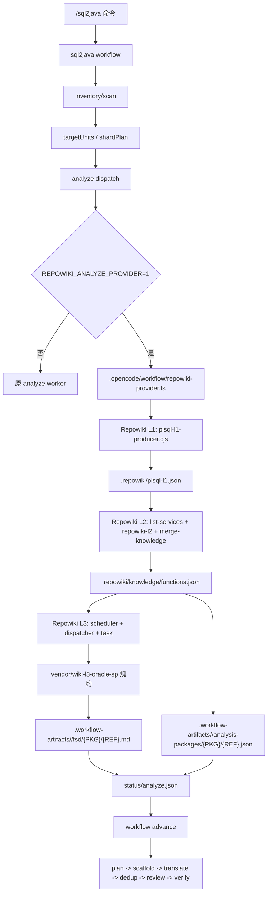

# sql2java-workflow-repowiki

本仓库是在 `sql2java-workflow` 工作流中接入 Repowiki Oracle 存储过程 FSD 生成能力的插件包。目标不是新建 Lingxi skill，也不是提交完整 Lingxi 离线运行时，而是在 `analyze` 阶段使用 Repowiki 已有 L1/L2/L3 链路生成 FSD 与 `analysis-packages`，再交给原 sql2java 后续 `plan/scaffold/translate` 消费。

## 仓库边界

本仓库提交：

- sql2java 工作流接入代码：`.opencode/workflow/repowiki-provider.ts`
- Repowiki 存过运行时：`vendor/repowiki-runtime/`
- Oracle 存过 L3 FSD 规约：`vendor/wiki-l3-oracle-sp/`
- 根目录 README：说明目录结构、运行方式、数据流和交付边界

本仓库不提交：

- `.gitignore` 改动
- `tests/ts/unit/` 测试改动
- `vendor/lingxicode-runtime/`
- `lingxicode.bat`
- `opencode.json`、模型 key、行内环境配置
- `.exe` 二进制启动器
- `.workflow-artifacts/`、`.repowiki/`、日志等运行产物
- `vendor/repowiki-runtime/eval/`、`vendor/repowiki-runtime/tests/`

## 接入架构



## 数据流和输出协议

| 阶段 | 输入 | 输出 | 下游使用 |
| --- | --- | --- | --- |
| sql2java inventory/scan | PL/SQL 项目目录 | `inventory.json`、`packages/*.json`、`subprograms/*.json`、`targetUnits`、`shardPlan` | 决定分片、包名、子程序名和后续调度边界 |
| Repowiki L1 | 同一 PL/SQL 项目目录 | `.repowiki/plsql-l1.json` | L2 生成函数事实、表事实、调用事实、控制流事实 |
| Repowiki L2 | L1 事实、`oracle-sp` profile | `.repowiki/knowledge/functions.json` | Provider 按当前 `targetUnits` 匹配事实 |
| Repowiki L3 | L2 facts、`wiki-l3-oracle-sp` 规约、FSD 模板 | FSD Markdown | sql2java 后续阶段读取 FSD |
| Provider publish | 当前分片、L2 fact、L3 FSD | `analysis-packages/{PKG}/{REF}.json`、`fsd/{PKG}/{REF}.md`、`status/analyze.json` | `advance` 收口 analyze 并进入后续阶段 |

当前阶段保留 sql2java 原 inventory/scan。原因是后续调度仍依赖 `targetUnits`、`shardPlan`、`packages/*.json`、`subprograms/*.json` 协议；Repowiki 先接管 `analyze/FSD` 输入质量，不在本仓库直接替换 scan。

## 合入目录结构和依据

```text
sql2java-workflow-repowiki/
|-- .opencode/
|   `-- workflow/
|       `-- repowiki-provider.ts
|-- vendor/
|   |-- repowiki-runtime/
|   |   |-- lib/
|   |   |-- profiles/
|   |   |   `-- oracle-sp.json
|   |   |-- templates/
|   |   |-- vendor/
|   |   |   |-- package.json
|   |   |   |-- package-lock.json
|   |   |   `-- node_modules/
|   |   |-- l3-worker-prompt.md
|   |   |-- list-services.cjs
|   |   |-- merge-knowledge.cjs
|   |   |-- repowiki-l2.cjs
|   |   |-- repowiki-l3-dispatcher.cjs
|   |   |-- repowiki-l3-scheduler.cjs
|   |   |-- repowiki-l3-task.cjs
|   |   |-- repowiki-progress.cjs
|   |   |-- README.md
|   |   `-- SKILL.md
|   `-- wiki-l3-oracle-sp/
|       |-- rules/
|       |-- templates/
|       |-- manifest.json
|       |-- selection-policy.json
|       |-- SKILL.md
|       `-- validation.json
`-- README.md
```

| 路径 | 合入依据 | 作用 |
| --- | --- | --- |
| `.opencode/workflow/repowiki-provider.ts` | sql2java analyze 阶段已有 Provider 接入点 | 定位 Repowiki runtime；自动执行 L1/L2；触发 L3；把 FSD 与 `analysis-packages` 写回 sql2java artifact 协议 |
| `vendor/repowiki-runtime/lib/plsql-l1-producer.cjs` | L1 存过事实入口 | 读取 PL/SQL 源码，生成包、子程序、参数、DDL、表列、控制流、异常、SQL 表操作等底层事实 |
| `vendor/repowiki-runtime/lib/plsql-l1-adapter.cjs` | L1 兼容适配 | 把 PL/SQL L1 结构转换成 Repowiki 后续模块可消费的事实形态 |
| `vendor/repowiki-runtime/lib/l1-adapter.cjs` | L2 通用输入适配 | 统一不同来源的 L1 节点、边和源码片段 |
| `vendor/repowiki-runtime/lib/l2-projection.cjs` | L2 投影 | 生成服务/函数粒度的事实视图 |
| `vendor/repowiki-runtime/lib/l2-callees.cjs` | L2 调用关系 | 汇总子程序调用、跨包调用等关系事实 |
| `vendor/repowiki-runtime/lib/l3-skill-contract.cjs` | L3 规约定位 | 根据 `wiki-l3-oracle-sp` manifest 定位 FSD 输出目录、模板、校验口径 |
| `vendor/repowiki-runtime/lib/l3-selection.cjs` | L3 范围选择 | 基于 profile 和 selection policy 选择要生成文档的函数范围 |
| `vendor/repowiki-runtime/lib/l3-graph-slice.cjs` | L3 任务证据切片 | 为每个 function-doc 任务准备局部事实上下文 |
| `vendor/repowiki-runtime/lib/fsd-facts-compiler.cjs` | FSD facts 编译 | 把 L2 函数事实编译为 FSD 可用结构 |
| `vendor/repowiki-runtime/lib/fsd-facts-renderer.cjs` | FSD 事实渲染 | 生成 FSD skeleton/draft 中的确定性事实区域 |
| `vendor/repowiki-runtime/lib/fsd-facts-schema.cjs` | FSD facts schema | 定义 facts 字段结构，避免 L3 输入散乱 |
| `vendor/repowiki-runtime/lib/fsd-facts-gate.cjs` | FSD 基础门禁 | 做文件、关键身份、必要事实等基础检查 |
| `vendor/repowiki-runtime/lib/fsd-facts-coverage.cjs` | FSD coverage 统计 | 汇总事实覆盖情况，支持问题定位 |
| `vendor/repowiki-runtime/lib/fsd-fact-tokens.cjs` | FSD trace token | 生成事实可追溯 token |
| `vendor/repowiki-runtime/lib/rows.cjs` | L3 清单行处理 | 支撑历史服务/功能清单模式，oracle-sp 当前主要使用 function facts 路径 |
| `vendor/repowiki-runtime/lib/xlsx.cjs` | 清单导出支持 | 支撑清单类产物导出 |
| `vendor/repowiki-runtime/list-services.cjs` | L2 前置入口 | 从 L1 输出生成模块、服务、函数索引 |
| `vendor/repowiki-runtime/repowiki-l2.cjs` | L2 主入口 | 生成 `.repowiki/knowledge/parts` 中的函数事实 |
| `vendor/repowiki-runtime/merge-knowledge.cjs` | L2 合并入口 | 合并 parts，生成 `.repowiki/knowledge/functions.json` |
| `vendor/repowiki-runtime/repowiki-l3-scheduler.cjs` | L3 调度入口 | 基于 L2 facts 和 oracle-sp 规约生成 L3 任务池 |
| `vendor/repowiki-runtime/repowiki-l3-dispatcher.cjs` | L3 并发派发 | 调用 Lingxi/opencode worker 并发生成 FSD 文档；在 L3 `ALL_DONE` 后清理残留 worker，避免 analyze 等待子进程而不收口 |
| `vendor/repowiki-runtime/repowiki-l3-task.cjs` | L3 任务控制 | claim/done/repair、FSD 输出路径、facts context 等任务控制 |
| `vendor/repowiki-runtime/repowiki-progress.cjs` | L3 进度读取 | dispatcher 读取和输出任务进度 |
| `vendor/repowiki-runtime/l3-worker-prompt.md` | L3 worker 提示词 | 约束 worker 按任务上下文、FSD facts 和 skill 规约生成文档 |
| `vendor/repowiki-runtime/profiles/oracle-sp.json` | 存过 profile | 指定 Oracle 存过链路使用的 L2/L3 profile |
| `vendor/repowiki-runtime/templates/` | Repowiki 通用模板 | 保留运行时对通用清单模板的引用 |
| `vendor/repowiki-runtime/vendor/package*.json` | 离线依赖清单 | 声明 PL/SQL parser 依赖 |
| `vendor/repowiki-runtime/vendor/node_modules/` | 离线 parser 依赖 | 提供 `@griffithswaite/ts-plsql-parser`、`antlr4` 等本地依赖，避免行内离线环境重新下载 |
| `vendor/wiki-l3-oracle-sp/manifest.json` | Oracle FSD skill manifest | 声明 docsDir、`REPOWIKI_L3_DOCS_ROOT`、function-facts 输出模式 |
| `vendor/wiki-l3-oracle-sp/SKILL.md` | Oracle FSD 生成规约入口 | L3 worker 读取的主规约 |
| `vendor/wiki-l3-oracle-sp/rules/` | Oracle FSD 细则 | 包含 FSD 生成、控制流图、转化映射规则 |
| `vendor/wiki-l3-oracle-sp/templates/` | Oracle FSD 模板 | 定义最终 FSD 文档模板 |
| `vendor/wiki-l3-oracle-sp/selection-policy.json` | L3 选择策略 | 控制 oracle-sp function-doc 任务选择范围 |
| `vendor/wiki-l3-oracle-sp/validation.json` | L3 校验口径 | 定义 oracle-sp 文档生成的校验配置 |

## 运行前提

行内环境需要已有 Lingxi/opencode 运行器。GitHub 仓库不提交 `vendor/lingxicode-runtime` 和 `lingxicode.bat`；部署时把本插件目录放到 Lingxi 可访问位置，并用环境变量指向运行器。

必须具备：

- Node.js 可执行文件，优先使用 Lingxi 自带 `config/bin/codegraph/node.exe`
- Lingxi/opencode runner，用于 L3 worker 调大模型
- 可用模型配置和 key，这些放在行内环境，不提交到仓库

## 环境变量

PowerShell 示例：

```powershell
$env:SQL2JAVA_HOME = "D:\path\to\sql2java-workflow-repowiki"
$env:LINGXICODE_ROOT = "D:\path\to\lingxicode-offline-v1.4.6-win10-x64-skills"
$env:REPOWIKI_ROOT = "$env:SQL2JAVA_HOME\vendor\repowiki-runtime"
$env:REPOWIKI_NODE_PATH = "$env:LINGXICODE_ROOT\config\bin\codegraph\node.exe"
$env:REPOWIKI_L3_RUNNER = "$env:LINGXICODE_ROOT\lingxicode.bat"
$env:REPOWIKI_ANALYZE_PROVIDER = "1"
$env:REPOWIKI_AUTO_PREPARE = "1"
$env:REPOWIKI_AUTO_PREPARE_FORCE = "1"
$env:REPOWIKI_PROFILE = "oracle-sp"
```

## 运行方式

只跑 inventory + analyze，用于验证 Repowiki FSD 接入：

```powershell
& "$env:REPOWIKI_L3_RUNNER" --print-logs --log-level INFO run --command sql2java -- --phases inventory,analyze resources\mfg_erp_sql_tiny
```

完整端到端不要加 `--phases`：

```powershell
& "$env:REPOWIKI_L3_RUNNER" --print-logs --log-level INFO run --command sql2java -- resources\mfg_erp_sql_tiny
```

`--phases inventory,analyze` 只验证到 FSD/analyze 产物，不会继续进入 `plan/scaffold/translate`。完整链路需要不带 `--phases`，让 workflow 在 analyze 完成后继续推进。

## 验收点

以 `resources\mfg_erp_sql_tiny` 为例，analyze 阶段通过需要满足：

- `run.json` 中 analyze 分片全部完成，例如 tiny 为 `13/13`
- `.workflow-artifacts/<runId>/status/repowiki-prepare.json` 为 `completed`
- `.workflow-artifacts/<runId>/status/repowiki-l3.json` 为 `completed`
- `.workflow-artifacts/<runId>/analysis-packages/{PKG}/{REF}.json` 存在
- `.workflow-artifacts/<runId>/fsd/{PKG}/{REF}.md` 存在
- standalone 函数必须写到 workflow 期望路径，例如：
  - `fsd/__STANDALONE_FN_ABC_CLASS__/FN_ABC_CLASS.md`
  - `analysis-packages/__STANDALONE_FN_ABC_CLASS__/FN_ABC_CLASS.json`

## standalone FSD 路径映射

sql2java inventory 对 standalone 函数会生成合成包名，例如：

```text
__STANDALONE_FN_ABC_CLASS__.FN_ABC_CLASS
```

Repowiki L3 可能按 L2 facts 先写到：

```text
fsd/__STANDALONE__/fn_abc_class.md
```

Provider 的 `publishFsdDoc()` 会在 analyze 写回时发布到 workflow 期望路径：

```text
fsd/__STANDALONE_FN_ABC_CLASS__/FN_ABC_CLASS.md
```

这一步是桥接 sql2java inventory 协议和 Repowiki L2/L3 facts 协议，不改变 L3 文档生成逻辑。
