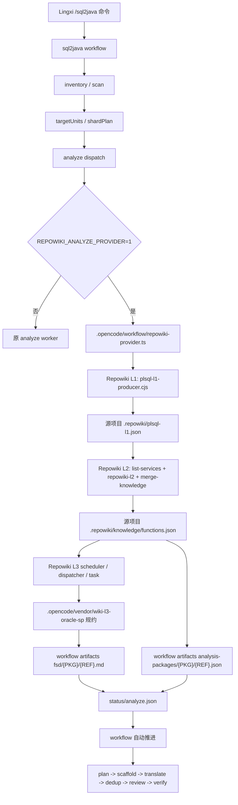

# sql2java-workflow-repowiki

本仓库是一个面向 Lingxi/opencode 的 `sql2java` 工作流插件包，用于在 `analyze` 阶段接入 Repowiki Oracle 存储过程 Wiki/FSD 生成链路。

边界很明确：Repowiki 不是独立外置目录，也不是重新写一个 skill；它作为 `.opencode` 工作流插件的一部分交付。行内环境只需要把本仓库放到 Lingxi 可访问的位置，并使用行内已安装的 Lingxi/opencode 启动器执行 `/sql2java`。

## 交付边界

本仓库提交：

- `.opencode/command/sql2java.md`：插件命令入口。
- `.opencode/workflow/*.ts`：原 `sql2java` 工作流实现，以及 Repowiki Provider 接入点。
- `.opencode/vendor/repowiki-runtime/`：Repowiki L1/L2/L3 运行时、Oracle 存过事实抽取、FSD 任务调度和依赖锁定文件。
- `.opencode/vendor/wiki-l3-oracle-sp/`：Oracle 存过 FSD 生成规约、模板、选择策略和校验配置。
- 根目录 `README.md`：插件结构、运行方式和数据流说明。

本仓库不提交：

- Lingxi 主程序、opencode 可执行文件、`vendor/lingxicode-runtime/`。
- 模型 key、`opencode.json`、行内环境配置。
- `.workflow-artifacts/`、`.repowiki/`、日志、运行产物。
- `.opencode/vendor/repowiki-runtime/vendor/node_modules/` 等依赖安装目录。
- 本地测试临时改动和无关运行样例产物。

## 目录结构

```text
sql2java-workflow-repowiki/
|-- .opencode/
|   |-- command/
|   |   `-- sql2java.md
|   |-- agent/
|   |-- workflow/
|   |   |-- workflow-engine-impl.ts
|   |   |-- repowiki-provider.ts
|   |   |-- inventory-builder.ts
|   |   |-- plsql-scanner.ts
|   |   `-- ...
|   |-- vendor/
|   |   |-- repowiki-runtime/
|   |   |   |-- lib/
|   |   |   |-- profiles/
|   |   |   |-- templates/
|   |   |   |-- vendor/
|   |   |   |   |-- package.json
|   |   |   |   `-- package-lock.json
|   |   |   |-- list-services.cjs
|   |   |   |-- repowiki-l2.cjs
|   |   |   |-- merge-knowledge.cjs
|   |   |   |-- repowiki-l3-scheduler.cjs
|   |   |   |-- repowiki-l3-dispatcher.cjs
|   |   |   |-- repowiki-l3-task.cjs
|   |   |   `-- repowiki-progress.cjs
|   |   `-- wiki-l3-oracle-sp/
|   |       |-- rules/
|   |       |-- templates/
|   |       |-- manifest.json
|   |       |-- selection-policy.json
|   |       |-- validation.json
|   |       `-- SKILL.md
|   `-- package.json
|-- package.json
|-- package-lock.json
`-- README.md
```

## 核心文件作用

| 路径 | 作用 |
| --- | --- |
| `.opencode/command/sql2java.md` | 暴露 `/sql2java` 命令入口。 |
| `.opencode/workflow/workflow-engine-impl.ts` | 原 workflow 编排主线；在 `analyze` dispatch 处调用 Repowiki Provider。 |
| `.opencode/workflow/repowiki-provider.ts` | Repowiki 接入适配层；自动跑 L1/L2/L3，并把 FSD 和 analysis package 写回 sql2java artifacts。 |
| `.opencode/vendor/repowiki-runtime/lib/plsql-l1-producer.cjs` | L1 入口，抽取 PL/SQL 包、子程序、参数、SQL、表、控制流、异常、事务等底层事实。 |
| `.opencode/vendor/repowiki-runtime/list-services.cjs` | 基于 L1 产物生成 Repowiki 模块和服务索引。 |
| `.opencode/vendor/repowiki-runtime/repowiki-l2.cjs` | L2 入口，生成函数级 facts。 |
| `.opencode/vendor/repowiki-runtime/merge-knowledge.cjs` | 合并 L2 parts，生成 `.repowiki/knowledge/functions.json`。 |
| `.opencode/vendor/repowiki-runtime/repowiki-l3-scheduler.cjs` | 基于 L2 facts 和 `wiki-l3-oracle-sp` 规约生成 L3 文档任务池。 |
| `.opencode/vendor/repowiki-runtime/repowiki-l3-dispatcher.cjs` | 并发派发 L3 worker 调 Lingxi/opencode 生成 FSD；完成后清理残留 worker。 |
| `.opencode/vendor/repowiki-runtime/repowiki-l3-task.cjs` | L3 任务 claim/done/repair、FSD 输出路径、事实上下文控制。 |
| `.opencode/vendor/repowiki-runtime/repowiki-progress.cjs` | 读取 Repowiki L3 任务进度。 |
| `.opencode/vendor/wiki-l3-oracle-sp/SKILL.md` | Oracle 存过 FSD 文档生成主规约。 |
| `.opencode/vendor/wiki-l3-oracle-sp/rules/` | Oracle 存过 FSD 细则。 |
| `.opencode/vendor/wiki-l3-oracle-sp/templates/` | FSD 文档模板。 |
| `.opencode/vendor/wiki-l3-oracle-sp/manifest.json` | L3 skill manifest，声明输出根、文档模式和模板信息。 |

## 数据流



## 阶段输入输出

| 阶段 | 输入 | 输出 | 下游使用 |
| --- | --- | --- | --- |
| inventory / scan | PL/SQL 项目目录 | `inventory.json`、`packages/*.json`、`subprograms/*.json`、`targetUnits`、`shardPlan` | 保留原 sql2java 调度边界，决定 analyze 分片。 |
| Repowiki L1 | 同一 PL/SQL 项目目录 | `.repowiki/plsql-l1.json` | 给 L2 提供包、子程序、SQL、表、控制流、异常、事务等事实。 |
| Repowiki L2 | L1 facts、`oracle-sp` profile | `.repowiki/knowledge/functions.json` | 给 L3 和 Provider 提供函数级事实。 |
| Repowiki L3 | L2 facts、`wiki-l3-oracle-sp` 规约、FSD 模板 | FSD Markdown | 写入 workflow artifacts 的 `fsd/{PKG}/{REF}.md`。 |
| Provider publish | 当前 analyze 分片、L2 fact、L3 FSD | `analysis-packages/{PKG}/{REF}.json`、`fsd/{PKG}/{REF}.md`、`status/analyze.json` | 让后续 `plan/scaffold/translate` 按原协议消费。 |

## 运行前提

行内环境需要已经安装 Lingxi/opencode。仓库不带 Lingxi 主程序和模型配置。

必须具备：

- Lingxi/opencode 启动器，例如行内安装目录下的 `lingxicode.bat`。
- Node.js，可优先使用 Lingxi 自带 `config/bin/codegraph/node.exe`。
- 可用模型配置和 key，由行内环境提供。

Repowiki runtime 和 Oracle FSD 规约已经内置在 `.opencode/vendor` 下，不需要再单独下载 Repowiki 代码。

Git 仓库不提交 `node_modules`。如果行内环境要求完全离线运行，应通过离线交付包或制品包附带 `.opencode/vendor/repowiki-runtime/vendor/node_modules/`，不要把该目录提交到 Git 历史里。

## 推荐运行方式

PowerShell 示例：

```powershell
cd "D:\path\to\sql2java-workflow-repowiki"

$env:SQL2JAVA_HOME = (Get-Location).Path
$env:LINGXICODE_ROOT = "D:\path\to\lingxicode"
$env:REPOWIKI_ANALYZE_PROVIDER = "1"
$env:REPOWIKI_AUTO_PREPARE = "1"
$env:REPOWIKI_AUTO_PREPARE_FORCE = "1"
$env:REPOWIKI_PROFILE = "oracle-sp"
$env:REPOWIKI_ROOT = "$env:SQL2JAVA_HOME\.opencode\vendor\repowiki-runtime"
$env:REPOWIKI_NODE_PATH = "$env:LINGXICODE_ROOT\config\bin\codegraph\node.exe"

& "$env:LINGXICODE_ROOT\lingxicode.bat" run "/sql2java resources\mfg_erp_sql_tiny"
```

只验证 Repowiki 接入到 `analyze`：

```powershell
& "$env:LINGXICODE_ROOT\lingxicode.bat" run "/sql2java --phases inventory,analyze resources\mfg_erp_sql_tiny"
```

完整端到端不要加 `--phases`，`analyze` 完成后 workflow 应继续进入 `plan/scaffold/translate`。

## 验收点

以 `resources\mfg_erp_sql_tiny` 为例，`analyze` 通过需要看到：

- `.workflow-artifacts/<runId>/status/repowiki-prepare.json` 存在且 `status=completed`。
- `.workflow-artifacts/<runId>/status/repowiki-l3.json` 存在且 `status=completed`。
- `.workflow-artifacts/<runId>/analysis-packages/{PKG}/{REF}.json` 存在。
- `.workflow-artifacts/<runId>/fsd/{PKG}/{REF}.md` 存在。
- standalone 函数发布到 workflow 期望路径，例如 `fsd/__STANDALONE_FN_ABC_CLASS__/FN_ABC_CLASS.md`。
- 完整运行时，`run.json` 在 analyze 完成后继续推进到后续阶段，而不是停在 analyze。

## 当前接入策略

当前版本保留原 sql2java `inventory / scan`，因为后续调度仍依赖它产出的 `targetUnits` 和 `shardPlan`。Repowiki 接管的是 `analyze` 阶段的 FSD 和 analysis package 输入质量。

后续如果要替换 scan，需要先证明 Repowiki L1 能稳定导出 sql2java 所需的 inventory view，包括 package、subprogram、targetUnits、shardPlan、procedureOrder 和 functionOwnership。
