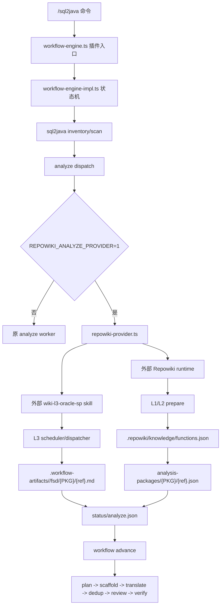

# sql2java-workflow-repowiki

本仓库是在 `sql2java-workflow` 工作流上接入已有 Repowiki Oracle 存储过程 FSD 生成链路的版本。目标不是重新写一个 skill，也不是把 Lingxi 离线包复制进仓库，而是在 sql2java 的 `analyze` 阶段接入 Repowiki 已有的 L1/L2/L3 能力，并继续向后续 `plan/scaffold/translate` 输出 sql2java 原有协议产物。

## 仓库边界

本仓库提交：

- sql2java 工作流接入代码。
- `/sql2java` 命令约定。
- Repowiki Provider 单元测试。
- 根目录这一份 README。

本仓库不提交：

- Lingxi runtime。
- `opencode.json` 等本地模型配置。
- `.exe`、`.bat` 等运行器二进制或启动脚本。
- `vendor/` 外部离线运行包。
- `.workflow-artifacts/`、`.repowiki/`、日志等运行产物。

运行时需要把本仓库放在已有 Lingxi 离线根目录可访问的位置，并通过环境变量指向外部 runtime。

## 本次合入文件

这次 Repowiki 接入相关的提交范围是：

```text
sql2java-workflow-repowiki/
├── .gitignore
├── .opencode/
│   ├── command/sql2java.md
│   ├── plugins/workflow-engine.ts
│   └── workflow/
│       ├── workflow-engine-impl.ts
│       └── repowiki-provider.ts
├── README.md
├── tests/ts/unit/
│   ├── plugin-export-boundary.test.ts
│   ├── repowiki-command-contract.test.ts
│   ├── repowiki-l3-contract.test.ts
│   ├── repowiki-l3-dispatcher.test.ts
│   └── repowiki-provider.test.ts
└── vitest.config.ts
```

说明：

- 新增实现主要在 `.opencode/workflow/repowiki-provider.ts`。
- `.opencode/plugins/workflow-engine.ts` 被收敛成薄入口，原大实现迁到 `.opencode/workflow/workflow-engine-impl.ts`。
- `.opencode/command/sql2java.md` 增加 Provider fast path，允许 Repowiki Provider 写完 analyze 产物后直接 `advance`。
- `tests/ts/unit/*repowiki*.test.ts` 是接入契约测试，不是运行时 skill。

## 接入架构



## 数据流

| 阶段 | 输入 | 输出 | 下游消费 |
| --- | --- | --- | --- |
| sql2java inventory/scan | PL/SQL 源码目录，`--header`，`--body`，`--mainEntry` | `inventory.json`、`packages/*.json`、`subprograms/*.json`、`targetUnits`、`shardPlan` | 决定分片和后续调度边界 |
| Repowiki L1 | 同一份 PL/SQL 源码目录 | `.repowiki/plsql-l1.json` 等源码事实 | L2 事实生成 |
| Repowiki L2 | L1 事实，`oracle-sp` profile | `.repowiki/knowledge/functions.json` | Provider 匹配当前 `targetUnits` |
| Repowiki L3 | L2 facts，`wiki-l3-oracle-sp` skill，FSD 规约 | `.workflow-artifacts/<runId>/fsd/{PKG}/{ref}.md` | sql2java 后续 translate 读取 FSD |
| Provider publish | L2 facts，L3 FSD，当前分片 | `analysis-packages/{PKG}/{ref}.json`、`status/analyze.json` | `advance` 收口 analyze，继续后续阶段 |

当前阶段保留 sql2java 的 inventory/scan，不直接替换 scan。原因是后续调度依赖 `targetUnits`、`shardPlan`、`packages/*.json`、`subprograms/*.json` 等协议；Repowiki 先接入 analyze/FSD 生成链路，后续再评估是否收敛成统一 PL/SQL 事实核心。

## 关键文件职责

| 文件 | 职责 |
| --- | --- |
| `.opencode/command/sql2java.md` | `/sql2java` 编排提示词，识别 Provider fast path，不把 Repowiki 当成新 skill。 |
| `.opencode/plugins/workflow-engine.ts` | opencode 插件入口，只导出插件，避免入口承担大实现。 |
| `.opencode/workflow/workflow-engine-impl.ts` | sql2java 状态机主实现，在 analyze dispatch 阶段调用 Provider。 |
| `.opencode/workflow/repowiki-provider.ts` | Repowiki 接入适配层：定位外部 runtime、执行 L1/L2 prepare、触发 L3 dispatcher、写回 sql2java analyze 协议产物。 |

## 外部 runtime 要求

准备一个已有 Lingxi 离线根目录，例如：

```text
lingxicode-offline-v1.4.6-win10-x64-skills/
├── lingxicode.bat
├── bin/opencode.exe
├── config/
│   ├── opencode.json
│   ├── bin/codegraph/node.exe
│   └── skills/
│       ├── repowiki/
│       └── wiki-l3-oracle-sp/
```

`opencode.json` 放在外部 Lingxi runtime 中，由本地环境维护，不提交到本仓库。模型 key 建议使用环境变量占位。

## 运行方式

PowerShell 示例：

```powershell
$env:LINGXICODE_ROOT = "D:\path\to\lingxicode-offline-v1.4.6-win10-x64-skills"
$env:REPOWIKI_ROOT = "$env:LINGXICODE_ROOT\config\skills\repowiki"
$env:REPOWIKI_NODE_PATH = "$env:LINGXICODE_ROOT\config\bin\codegraph\node.exe"
$env:REPOWIKI_L3_RUNNER = "$env:LINGXICODE_ROOT\lingxicode.bat"

$env:DASHSCOPE_API_KEY = "<your-api-key>"
$env:REPOWIKI_ANALYZE_PROVIDER = "1"
$env:REPOWIKI_AUTO_PREPARE = "1"
$env:REPOWIKI_PROFILE = "oracle-sp"

& "$env:LINGXICODE_ROOT\lingxicode.bat" --print-logs --log-level WARN run --command sql2java -- resources\mfg_erp_sql_tiny
```

只验证 inventory/analyze：

```powershell
& "$env:LINGXICODE_ROOT\lingxicode.bat" --print-logs --log-level WARN run --command sql2java -- --phases inventory,analyze resources\mfg_erp_sql_tiny
```

完整端到端不要加 `--phases`，让 workflow 继续进入 `plan/scaffold/translate/dedup/review/verify`。

## Provider 行为

启用条件：

```text
REPOWIKI_ANALYZE_PROVIDER=1
```

自动准备 L1/L2：

```text
REPOWIKI_AUTO_PREPARE=1
```

默认 profile：

```text
REPOWIKI_PROFILE=oracle-sp
```

Provider 会：

1. 使用 sql2java scan 产出的当前 `targetUnits`。
2. 调用外部 Repowiki L1/L2 生成或复用 `.repowiki/knowledge/functions.json`。
3. 调用外部 `wiki-l3-oracle-sp` 的 L3 scheduler/dispatcher 生成 FSD。
4. 把 FSD 写入 `.workflow-artifacts/<runId>/fsd/{PKG}/{ref}.md`。
5. 把 L2 facts 映射为 `.workflow-artifacts/<runId>/analysis-packages/{PKG}/{ref}.json`。
6. 写 `status/analyze.json`，让 sql2java workflow 继续推进。

## 验证

聚焦测试：

```powershell
npm test -- tests/ts/unit/repowiki-command-contract.test.ts tests/ts/unit/plugin-export-boundary.test.ts tests/ts/unit/repowiki-provider.test.ts tests/ts/unit/repowiki-l3-contract.test.ts tests/ts/unit/repowiki-l3-dispatcher.test.ts
```

这组测试验证：

- `/sql2java` 命令中存在 Provider fast path。
- 插件入口只保留导出边界。
- Provider 能按 sql2java target unit 写 analyze 产物。
- L3 scheduler/dispatcher 被调用并写入 sql2java artifact 根。
- 缺少 L2 facts 时不会派发原 analyze worker 混跑。
