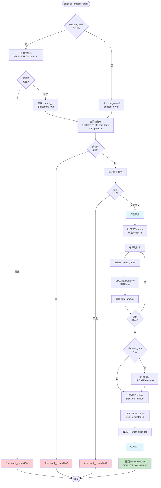

# 存储过程转 FSD（功能规格文档）设计方案

## Context

当前 sql2java 工作流：`inventory → analyze → plan → scaffold → translate → dedup → review → verify`

`analyze` 阶段产出的 `analysis.json` 侧重于**结构化解析**（调用图、拓扑排序、语句块分类），但 `translator` 在翻译前还需要更**面向业务语义**的信息——表结构映射、校验规则、业务逻辑流程、特殊语法转化规约。这些信息目前散落在 `analysis.json` 的 `translationNotes`、`inventory.json` 的表定义和源码本身中，缺乏一份集中的"翻译说明书"。

**FSD（Functional Specification Document）** 就是这份翻译说明书。它基于 `outline.md`（`f_format_amount` 转换大纲）的实践格式，标准化为 6 板块结构，为 `plan` 和 `translate` 阶段提供业务级转译指导。

---

## Part 1: FSD 文档结构设计

### 1.1 从 outline.md 提炼的原始格式

`outline.md` 对 `f_format_amount` 函数产出了 4 个板块：

| 板块 | 内容 | 对应 workflow 数据源 |
|------|------|---------------------|
| 概述 | 功能描述 + 转换策略 | inventory.json (签名) + analysis.json (translationNotes) |
| 实体类设计 | DO / DTO / Result 类 | inventory.json (tables) + plan.json (typeMappings) |
| 子函数调用 | 跨包依赖 + 已解析 Java 方法 | analysis.json (callGraph + packageDependency) |
| 业务逻辑 | 方法定义 + 逻辑流程 + 异常处理 | analysis.json (blocks + exceptionHandlers) + 源码 |

### 1.2 标准化 FSD 结构（6 板块）

在 outline.md 的 4 板块基础上扩展为 6 板块，增强**控制流可视化**和**特殊语法转化**两个维度：

```
FSD 文档
├── 1. 概览（Overview）
│   ├── 存储过程名、签名、功能摘要
│   ├── 参数清单 + Java 类型映射（IN/OUT/IN OUT）
│   ├── 返回值说明
│   └── 转换策略概述（设计模式选择、命名方向）
│
├── 2. 表结构映射（Table-Entity Mapping）
│   ├── 涉及的表清单 + 操作类型（SELECT/INSERT/UPDATE/DELETE）
│   ├── 每张表的列 → DO 字段映射
│   ├── 跨表关系（JOIN、外键引用）
│   └── 特殊列处理（LOB、虚拟列、自增列）
│
├── 3. 依赖分析（Dependencies）
│   ├── 调用的其他包/函数/过程（含已解析的 Java 方法）
│   ├── 被其他包调用的入口标记
│   ├── 共享类型/变量依赖
│   └── 跨包调用 → Service 注入关系
│
├── 4. 业务规则（Business Rules）
│   ├── 校验规则（参数、状态、唯一性）
│   ├── 计算逻辑（公式、折扣、金额）
│   ├── 状态流转
│   └── 边界条件（空值、零值、溢出、并发）
│
├── 5. 控制流与异常（Control Flow & Exceptions）
│   ├── Mermaid 流程图
│   ├── 分支条件及对应处理
│   ├── 循环结构（游标 LOOP → Java for-each）
│   └── 异常处理路径（WHEN OTHERS → try-catch）
│
└── 6. 特殊语法转化规约（Special Syntax Conventions）
    ├── Oracle 专有构造 → Java/MyBatis 等价写法
    ├── 事务边界说明
    └── 需手动审查的构造清单（标记 TODO）
```

### 1.3 各板块详细说明

#### 板块 1：概览（Overview）

**对应 outline.md**："一、概述"

**数据来源**：`inventory.json`（签名） + `analysis.json`（复杂度、翻译注意事项）

**格式**：

```markdown
## 1. 概览

### 1.1 存储过程功能

**名称**：sp_xxx
**类型**：PROCEDURE / FUNCTION
**主要功能**：一句话描述

**处理逻辑**：
- 步骤 1 描述
- 步骤 2 描述
- ...

### 1.2 参数清单与 Java 类型映射

| Oracle 参数 | 方向 | Oracle 类型 | Java 类型 | 说明 |
|------------|------|------------|----------|------|
| p_xxx | IN | NUMBER | BigDecimal | ... |
| p_yyy | OUT | VARCHAR2 | String (返回值) | ... |

**返回值**：（Function 才有）
- Oracle: VARCHAR2 → Java: String

### 1.3 转换策略

1. **服务映射**：sp_xxx → XxxService.spXxx()
2. **参数封装**：入参数量 → 独立参数 or DTO
3. **返回类型**：Oracle 返回类型 → Java 类型
4. **设计模式**：Service / Util / ...
5. **异常处理**：策略概述
```

#### 板块 2：表结构映射（Table-Entity Mapping）

**对应 outline.md**："二、实体类设计"

**数据来源**：`inventory.json`（tables、columns） + `analysis.json`（blocks 中引用的表）

**格式**：

```markdown
## 2. 表结构映射

### 2.1 涉及的表清单

| 表名 | 操作类型 | DO 类名 | 说明 |
|------|---------|---------|------|
| ORDERS | INSERT, UPDATE | OrderDO | 订单主表 |
| ORDER_ITEMS | INSERT | OrderItemDO | 订单明细 |

### 2.2 列 → DO 字段映射

#### ORDERS 表 → OrderDO

| 列名 | Oracle 类型 | Java 类型 | Java 字段名 | 可空 | 主键 | 本 SP 使用 |
|------|------------|----------|------------|------|------|-----------|
| ID | NUMBER | Long | id | N | Y | ✓ |
| CUSTOMER_ID | NUMBER | Long | customerId | N | | ✓ |
| STATUS | VARCHAR2(20) | String | status | N | | ✓ |
| TOTAL_AMOUNT | NUMBER(12,2) | BigDecimal | totalAmount | Y | | ✓ |

### 2.3 跨表关系

| 关系 | 类型 | 说明 |
|------|------|------|
| ORDER_ITEMS.ORDER_ID → ORDERS.ID | FK | 订单明细关联订单主表 |
| CART_ITEMS.PRODUCT_ID → PRODUCTS.ID | FK | 购物车关联商品 |

### 2.4 特殊列处理

| 表.列 | 特殊类型 | 处理方式 |
|-------|---------|---------|
| ORDERS.CREATED_AT | DEFAULT SYSDATE | 由数据库生成，Java 不设值 |
```

#### 板块 3：依赖分析（Dependencies）

**对应 outline.md**："三、子函数调用"

**数据来源**：`analysis.json`（callGraph、packageDependency）

**格式**：

```markdown
## 3. 依赖分析

### 3.1 调用的其他子程序

| Oracle 调用 | 目标包 | 功能 | 已解析 Java 方法 | 状态 |
|------------|--------|------|-----------------|------|
| f_get_decimal_rtype(ccy) | UTIL_PKG | 获取小数位数 | CurrInfoService.fGetDecimalRtype() | ✓ 已有 |
| f_num_to_deci(amount, n) | UTIL_PKG | 格式化 | NumberFormatUtil.fNumToDeci() | ✓ 已有 |
| sp_calc_tax(order_id) | ORDER_UTIL | 计算税费 | OrderUtilService.spCalcTax() | ✗ 待翻译 |

**结论**：所有依赖均已转换为 Java 方法（或标注待翻译）。

### 3.2 被其他子程序调用

| 调用方 | 入口 |
|--------|------|
| ORDER_BATCH_PKG.sp_batch_process | 本 SP 被批量处理调用 |

### 3.3 跨包调用 → Service 注入

本 SP 翻译后的 ServiceImpl 需注入以下 Service：

| 字段 | 类型 | 来源包 | 用途 |
|------|------|--------|------|
| orderUtilService | OrderUtilService | ORDER_UTIL | 调用 sp_calc_tax |
| couponService | CouponService | COUPON_PKG | 调用 f_validate_coupon |
```

#### 板块 4：业务规则（Business Rules）

**对应 outline.md**："四、业务逻辑"（核心部分）

**数据来源**：`analysis.json`（blocks + 源码分析）

**格式**：

```markdown
## 4. 业务规则

### 4.1 校验规则

| 规则 ID | 类别 | 描述 | Oracle 位置 | Java 实现 |
|---------|------|------|------------|----------|
| VAL-001 | 参数校验 | 优惠券 code 不能为空 | line 28 | if (StringUtils.isBlank(couponCode)) |
| VAL-002 | 状态校验 | 优惠券必须为 ACTIVE 且未过期 | line 28-33 | mapper.selectActiveCoupon() == null → return 1001 |
| VAL-003 | 库存校验 | 每件商品库存必须 ≥ 购买数量 | line 38-48 | for loop + mapper.checkStock() == 0 → return 1002 |

### 4.2 计算逻辑

| 逻辑 ID | 描述 | Oracle 表达式 | Java 实现 |
|---------|------|-------------|----------|
| CALC-001 | 订单明细小计 | v_quantity * v_item_price | quantity.multiply(unitPrice) |
| CALC-002 | 订单总金额 | SUM(subtotal) | totalAmount = totalAmount.add(subtotal) |
| CALC-003 | 折扣计算 | total * (1 - discount_rate / 100) | totalAmount.multiply(BigDecimal.ONE.subtract(discountRate.divide(...))) |

### 4.3 状态流转

```
购物车(CREATED) → 下单成功(ORDERED) → [折扣应用] → 最终订单(COMPLETED)
```

| 转换 | 条件 | 操作 |
|------|------|------|
| → CREATED | 库存校验通过 | INSERT INTO orders (status='CREATED') |
| → ORDERED | 所有明细插入完成 | UPDATE orders SET total_amount |
| → COMPLETED | 折扣应用完成 | UPDATE coupons SET status='USED' |

### 4.4 边界条件

| 条件 | 处理方式 | Oracle 行为 | Java 映射 |
|------|---------|------------|----------|
| 购物车为空 | 提前退出 | RETURN | return result(1003) |
| 优惠券不存在 | 返回错误码 | result_code = 1001 | result.setResultCode(1001) |
| 库存不足 | 返回错误码 | result_code = 1002 | result.setResultCode(1002) |
| 金额溢出 | Oracle NUMBER 精度 | 无溢出 | BigDecimal 自动扩展 |
| 并发扣库存 | 无锁（存储过程串行） | 无 | WHERE available_qty >= #{qty} |
```

#### 板块 5：控制流与异常（Control Flow & Exceptions）

**数据来源**：`analysis.json`（blocks、loops、exceptionHandlers）

**格式**：

```markdown
## 5. 控制流与异常

### 5.1 流程图

（Mermaid 语法，可直接渲染）

### 5.2 分支逻辑

| 分支 ID | 条件 | 真分支 | 假分支 | Oracle 行号 |
|---------|------|--------|--------|------------|
| BR-001 | v_coupon_id IS NULL | 返回 1001 | 继续校验 | line 34-36 |
| BR-002 | v_discount_rate > 0 | 应用折扣 | 跳过折扣 | line 62-67 |
| BR-003 | flag = 'N' or 'n' | 无千分位 | 有千分位 | (outline.md 示例) |

### 5.3 循环结构

| 循环 ID | 类型 | Oracle 构造 | Java 映射 | 退出条件 |
|---------|------|------------|----------|---------|
| LOOP-001 | 游标循环(库存检查) | OPEN/FETCH cart_cursor | for (item : cartItems) | 游标耗尽 |
| LOOP-002 | 游标循环(插入明细) | OPEN/FETCH cart_cursor | for (item : cartItems) | 游标耗尽 |

### 5.4 异常处理

| 异常 | Oracle 处理 | Java 映射 | 处理方式 |
|------|------------|----------|---------|
| SQLEXCEPTION | ROLLBACK + result_code = -1 | @Transactional(rollbackFor) | Spring 自动回滚 |
| NO_DATA_FOUND | (隐式) SELECT INTO 空 | catch (EmptyResultDataAccessException) | 设为 null |
```

#### 板块 6：特殊语法转化规约（Special Syntax Conventions）

**数据来源**：`analysis.json`（translationNotes） + 源码分析

**格式**：

```markdown
## 6. 特殊语法转化规约

### 6.1 Oracle → Java 构造映射

| Oracle 构造 | 出现位置 | Java/MyBatis 等价 | 风险 |
|------------|---------|-----------------|------|
| CURSOR cart_cursor IS SELECT ... | line 18-22 | mapper.selectCartItems() 返回 List | ✓ 安全 |
| SELECT ... INTO v_coupon_id | line 28-33 | mapper.selectActiveCoupon() + null 检查 | ✓ 安全 |
| LAST_INSERT_ID() | line 52 | useGeneratedKeys=true, keyProperty="id" | ✓ 安全 |

### 6.2 事务边界

| Oracle 构造 | Java 映射 |
|------------|----------|
| START TRANSACTION ... COMMIT/ROLLBACK | @Transactional(rollbackFor = Exception.class) |
| 整体在事务中 | 方法级注解 |

### 6.3 需手动审查的构造

| 构造 | 位置 | 原因 | 建议 |
|------|------|------|------|
| (无) | — | — | — |
```

---

## Part 2: FSD 完整示例 — `sp_process_order`

以下用 `sql2java-standard-example.md` 中的 `sp_process_order` 存储过程，按 6 板块格式生成完整 FSD。

---

### 1. 概览

#### 1.1 存储过程功能

**名称**：`sp_process_order`
**类型**：PROCEDURE
**主要功能**：处理下单流程（校验优惠券 → 校验库存 → 创建订单 → 扣库存 → 应用折扣 → 清空购物车 → 记录日志）

**处理逻辑**：
- 根据优惠券代码查询并校验优惠券有效性
- 遍历购物车校验每件商品库存是否充足
- 开启事务，创建订单主记录
- 遍历购物车，插入订单明细 + 扣减库存 + 累加金额
- 应用优惠券折扣（如有）
- 更新订单总金额、标记优惠券已使用、清空购物车
- 记录操作审计日志

#### 1.2 参数清单与 Java 类型映射

| Oracle 参数 | 方向 | Oracle 类型 | Java 类型 | 说明 |
|------------|------|------------|----------|------|
| p_customer_id | IN | BIGINT | Long | 下单客户 ID |
| p_coupon_code | IN | VARCHAR(32) | String | 优惠券代码（可为空） |
| p_order_id | OUT | BIGINT | Long (返回值字段) | 生成的订单 ID |
| p_total_amount | OUT | DECIMAL(12,2) | BigDecimal (返回值字段) | 订单总金额 |
| p_result_code | OUT | INT | Integer (返回值字段) | 结果码（0=成功, 1001=优惠券无效, 1002=库存不足, -1=异常） |

**Java 参数策略**：入参 2 个（p_customer_id, p_coupon_code）→ 独立参数，不封装 DTO。
**Java 返回值**：OUT 参数 3 个 → 封装为 `CreateOrderResult` DTO。

#### 1.3 转换策略

1. **服务映射**：`sp_process_order` → `OrderService.processOrder(CreateOrderRequest)`
2. **参数封装**：入参 ≤ 5 → 独立参数（通过 `CreateOrderRequest` 传入）
3. **返回类型**：3 个 OUT 参数 → `CreateOrderResult` DTO（resultCode, orderId, totalAmount）
4. **设计模式**：Service 模式，事务由 `@Transactional` 管理
5. **异常处理**：全局 `@Transactional(rollbackFor = Exception.class)`，取代 Oracle 的 `DECLARE CONTINUE HANDLER FOR SQLEXCEPTION`

---

### 2. 表结构映射

#### 2.1 涉及的表清单

| 表名 | 操作类型 | DO 类名 | 说明 |
|------|---------|---------|------|
| ORDERS | INSERT, UPDATE | OrderDO | 订单主表 |
| ORDER_ITEMS | INSERT | OrderItemDO | 订单明细表 |
| CART_ITEMS | SELECT, UPDATE | CartItemDO | 购物车表 |
| PRODUCTS | SELECT (JOIN) | ProductDO | 商品表（仅 JOIN 查询） |
| INVENTORY | SELECT, UPDATE | InventoryDO | 库存表 |
| COUPONS | SELECT, UPDATE | CouponDO | 优惠券表 |
| ORDER_AUDIT_LOG | INSERT | OrderAuditLogDO | 操作审计日志表 |

共 **7 张表**，其中 PRODUCTS 仅作为 JOIN 被引用，不需要独立 Mapper 方法。

#### 2.2 列 → DO 字段映射

##### ORDERS 表 → OrderDO

| 列名 | Oracle 类型 | Java 类型 | Java 字段名 | 可空 | 主键 | 本 SP 使用 |
|------|------------|----------|------------|------|------|-----------|
| ID | BIGINT | Long | id | N | Y | ✓ (INSERT + UPDATE) |
| CUSTOMER_ID | BIGINT | Long | customerId | N | | ✓ (INSERT) |
| STATUS | VARCHAR(20) | String | status | N | | ✓ (INSERT, 值='CREATED') |
| TOTAL_AMOUNT | DECIMAL(12,2) | BigDecimal | totalAmount | Y | | ✓ (UPDATE) |
| COUPON_ID | BIGINT | Long | couponId | Y | | ✓ (INSERT) |
| CREATED_AT | DATETIME | LocalDateTime | createdAt | N | | ✓ (INSERT, DEFAULT NOW()) |
| UPDATED_AT | DATETIME | LocalDateTime | updatedAt | Y | | — |

##### ORDER_ITEMS 表 → OrderItemDO

| 列名 | Oracle 类型 | Java 类型 | Java 字段名 | 可空 | 主键 | 本 SP 使用 |
|------|------------|----------|------------|------|------|-----------|
| ID | BIGINT | Long | id | N | Y | ✓ (自增) |
| ORDER_ID | BIGINT | Long | orderId | N | | ✓ (INSERT) |
| PRODUCT_ID | BIGINT | Long | productId | N | | ✓ (INSERT) |
| QUANTITY | INT | Integer | quantity | N | | ✓ (INSERT) |
| UNIT_PRICE | DECIMAL(10,2) | BigDecimal | unitPrice | N | | ✓ (INSERT) |
| SUBTOTAL | DECIMAL(12,2) | BigDecimal | subtotal | N | | ✓ (INSERT, 计算) |

##### CART_ITEMS 表 → CartItemDO

| 列名 | Oracle 类型 | Java 类型 | Java 字段名 | 可空 | 主键 | 本 SP 使用 |
|------|------------|----------|------------|------|------|-----------|
| ID | BIGINT | Long | id | N | Y | — |
| CUSTOMER_ID | BIGINT | Long | customerId | N | | ✓ (SELECT + UPDATE WHERE) |
| PRODUCT_ID | BIGINT | Long | productId | N | | ✓ (SELECT) |
| QUANTITY | INT | Integer | quantity | N | | ✓ (SELECT) |
| IS_DELETED | INT | Integer | isDeleted | N | | ✓ (UPDATE: 0→1) |

**注意**：SELECT 查询中 JOIN 了 PRODUCTS 表获取 `price`（映射为 `unitPrice`），该字段不在 CART_ITEMS 表中，需通过 Mapper SQL 获取。

##### PRODUCTS 表 → ProductDO

| 列名 | Oracle 类型 | Java 类型 | Java 字段名 | 可空 | 主键 | 本 SP 使用 |
|------|------------|----------|------------|------|------|-----------|
| ID | BIGINT | Long | id | N | Y | ✓ (JOIN 条件) |
| NAME | VARCHAR(200) | String | name | N | | — |
| PRICE | DECIMAL(10,2) | BigDecimal | price | N | | ✓ (SELECT, 作为 unit_price) |

##### INVENTORY 表 → InventoryDO

| 列名 | Oracle 类型 | Java 类型 | Java 字段名 | 可空 | 主键 | 本 SP 使用 |
|------|------------|----------|------------|------|------|-----------|
| ID | BIGINT | Long | id | N | Y | — |
| PRODUCT_ID | BIGINT | Long | productId | N | | ✓ (SELECT + UPDATE WHERE) |
| AVAILABLE_QTY | INT | Integer | availableQty | N | | ✓ (SELECT 检查 + UPDATE 扣减) |
| LOCKED_QTY | INT | Integer | lockedQty | N | | ✓ (UPDATE 增加) |

##### COUPONS 表 → CouponDO

| 列名 | Oracle 类型 | Java 类型 | Java 字段名 | 可空 | 主键 | 本 SP 使用 |
|------|------------|----------|------------|------|------|-----------|
| ID | BIGINT | Long | id | N | Y | ✓ (SELECT + UPDATE WHERE) |
| CODE | VARCHAR(32) | String | code | N | | ✓ (SELECT WHERE) |
| STATUS | VARCHAR(20) | String | status | N | | ✓ (SELECT WHERE + UPDATE) |
| DISCOUNT_RATE | DECIMAL(4,2) | BigDecimal | discountRate | Y | | ✓ (SELECT) |
| EXPIRE_TIME | DATETIME | LocalDateTime | expireTime | Y | | ✓ (SELECT WHERE) |
| USED_AT | DATETIME | LocalDateTime | usedAt | Y | | ✓ (UPDATE) |
| USED_BY | BIGINT | Long | usedBy | Y | | ✓ (UPDATE) |

##### ORDER_AUDIT_LOG 表 → OrderAuditLogDO

| 列名 | Oracle 类型 | Java 类型 | Java 字段名 | 可空 | 主键 | 本 SP 使用 |
|------|------------|----------|------------|------|------|-----------|
| ID | BIGINT | Long | id | N | Y | ✓ (自增) |
| ORDER_ID | BIGINT | Long | orderId | N | | ✓ (INSERT) |
| ACTION | VARCHAR(50) | String | action | N | | ✓ (INSERT, 值='CREATE_ORDER') |
| OPERATOR_ID | BIGINT | Long | operatorId | N | | ✓ (INSERT) |
| CREATED_AT | DATETIME | LocalDateTime | createdAt | N | | ✓ (INSERT, DEFAULT NOW()) |

#### 2.3 跨表关系

| 关系 | 类型 | 说明 |
|------|------|------|
| ORDER_ITEMS.ORDER_ID → ORDERS.ID | 主从 | 订单明细属于订单 |
| CART_ITEMS.CUSTOMER_ID → CUSTOMERS.ID | 外键 | 购物车属于客户 |
| CART_ITEMS.PRODUCT_ID → PRODUCTS.ID | 外键 | 购物车项关联商品 |
| INVENTORY.PRODUCT_ID → PRODUCTS.ID | 外键 | 库存关联商品 |
| COUPONS.ID → ORDERS.COUPON_ID | 反向引用 | 订单使用的优惠券 |

#### 2.4 特殊列处理

| 表.列 | 特殊类型 | 处理方式 |
|-------|---------|---------|
| ORDERS.ID | AUTO_INCREMENT | MyBatis `useGeneratedKeys=true` |
| ORDERS.CREATED_AT | DEFAULT NOW() | Java 传入 `LocalDateTime.now()`，或数据库默认 |
| COUPONS.DISCOUNT_RATE | DECIMAL(4,2) | 存储百分比值（如 15.00 表示 15%），计算时需 `/100` |

---

### 3. 依赖分析

#### 3.1 调用的其他子程序

`sp_process_order` 不直接调用其他存储过程或函数，所有逻辑内部完成。

| Oracle 调用 | 目标包 | 功能 | 已解析 Java 方法 | 状态 |
|------------|--------|------|-----------------|------|
| （无外部调用） | — | — | — | — |

**结论**：无跨包依赖，可独立翻译。

#### 3.2 被其他子程序调用

| 调用方 | 入口 |
|--------|------|
| （待其他 SP 分析后补充） | |

#### 3.3 跨包调用 → Service 注入

本 SP 无跨包调用，ServiceImpl 只需注入本包 Mapper：

| 字段 | 类型 | 用途 |
|------|------|------|
| orderMapper | OrderMapper | 本 SP 所有 SQL 操作 |

---

### 4. 业务规则

#### 4.1 校验规则

| 规则 ID | 类别 | 描述 | Oracle 位置 | Java 实现 |
|---------|------|------|------------|----------|
| VAL-001 | 参数校验 | 优惠券 code 存在时才校验 | line 28-36 | `if (StringUtils.isNotBlank(couponCode))` |
| VAL-002 | 状态校验 | 优惠券必须 status='ACTIVE' 且 expire_time > NOW() | line 28-33 | `mapper.selectActiveCoupon(code)` 返回 null 则无效 |
| VAL-003 | 库存校验 | 每件商品 available_qty >= 购买数量 | line 38-48 | `mapper.checkStock(productId, qty)` 返回 0 则不足 |
| VAL-004 | 购物车校验 | 购物车不能为空 | 隐含（游标返回 0 行） | `cartItems.isEmpty()` → 返回 1003 |

#### 4.2 计算逻辑

| 逻辑 ID | 描述 | Oracle 表达式 | Java 实现 |
|---------|------|-------------|----------|
| CALC-001 | 订单明细小计 | `v_quantity * v_item_price` | `quantity.multiply(unitPrice)` |
| CALC-002 | 累加总金额 | `p_total_amount = p_total_amount + subtotal` | `totalAmount = totalAmount.add(subtotal)` |
| CALC-003 | 折扣计算 | `total * (1 - discount_rate / 100)` | `totalAmount.multiply(BigDecimal.ONE.subtract(discountRate.divide(HUNDRED, 2, HALF_UP)))` |
| CALC-004 | 无折扣时 | `total_amount = total_amount`（原样） | 不应用折扣逻辑 |

#### 4.3 状态流转

```
优惠券校验 → 库存校验 → [创建订单] → [插入明细+扣库存] → [应用折扣] → [更新金额+清购物车+记日志] → 完成
```

| 转换 | 条件 | 操作 |
|------|------|------|
| → 优惠券校验 | couponCode 不为空 | SELECT coupons WHERE code = ? AND status = 'ACTIVE' |
| → 库存校验 | 优惠券有效或无优惠券 | 游标遍历购物车 + SELECT inventory |
| → 创建订单 | 全部校验通过 | INSERT INTO orders (status='CREATED', total=0) |
| → 插入明细 | 订单创建成功 | 循环 INSERT order_items + UPDATE inventory |
| → 应用折扣 | discount_rate > 0 | UPDATE coupons SET status='USED' |
| → 完成 | 全部成功 | UPDATE orders SET total_amount, UPDATE cart_items SET is_deleted=1 |

#### 4.4 边界条件

| 条件 | 处理方式 | Oracle 行为 | Java 映射 |
|------|---------|------------|----------|
| 优惠券不存在/已过期 | result_code = 1001，提前退出 | IF v_coupon_id IS NULL THEN SET 1001 | `if (coupon == null) { result.setResultCode(1001); return result; }` |
| 库存不足 | result_code = 1002，提前退出 | IF v_stock_enough = 0 THEN SET 1002 | `if (stockAvailable == 0) { result.setResultCode(1002); return result; }` |
| 购物车为空 | result_code = 1003 | 隐含（游标无数据） | `if (cartItems.isEmpty()) { result.setResultCode(1003); return result; }` |
| 金额精度 | Oracle NUMBER 自动 | DECIMAL(12,2) 精度 | BigDecimal + `setScale(2, HALF_UP)` |
| 并发扣库存 | 存储过程串行执行 | 无锁竞争 | `WHERE available_qty >= #{quantity}` 乐观保护 |
| 全局异常 | ROLLBACK + result_code = -1 | DECLARE CONTINUE HANDLER | `@Transactional(rollbackFor)` 自动回滚 |

---

### 5. 控制流与异常

#### 5.1 流程图



#### 5.2 分支逻辑

| 分支 ID | 条件 | 真分支 | 假分支 | Oracle 行号 |
|---------|------|--------|--------|------------|
| BR-001 | coupon_code 不为空 | 查询优惠券 | 跳过优惠券校验 | line 28 |
| BR-002 | v_coupon_id IS NULL | 返回 1001 | 继续库存校验 | line 34-36 |
| BR-003 | v_stock_enough = 0 | 返回 1002 | 继续下一件商品 | line 44-47 |
| BR-004 | 游标 done | 退出循环 | 继续处理商品 | line 39, 57 |
| BR-005 | v_discount_rate > 0 | 应用折扣 + 标记已用 | 跳过折扣 | line 62-67 |

#### 5.3 循环结构

| 循环 ID | 类型 | Oracle 构造 | Java 映射 | 遍历对象 | 退出条件 |
|---------|------|------------|----------|---------|---------|
| LOOP-001 | 游标循环（库存检查） | `OPEN cart_cursor; FETCH ... LOOP` | `for (CartItemDO item : cartItems)` | 购物车商品 | List 遍历完 |
| LOOP-002 | 游标循环（插入明细） | `OPEN cart_cursor; FETCH ... LOOP` | `for (CartItemDO item : cartItems)` | 购物车商品 | List 遍历完 |

**注意**：Oracle 中同一游标被打开两次（一次校验库存，一次插入明细）。Java 中查询一次 `selectCartItems()` 返回 List，两个 for 循环复用同一个 List。

#### 5.4 异常处理

| 异常 | Oracle 处理 | Java 映射 | 处理方式 |
|------|------------|----------|---------|
| SQLEXCEPTION (全局) | `DECLARE CONTINUE HANDLER → ROLLBACK; result_code = -1` | `@Transactional(rollbackFor = Exception.class)` | Spring 自动回滚 + 方法自然抛出异常 |
| SELECT INTO 无数据 | (隐式 NO_DATA_FOUND) | 不适用（本 SP 用 COUNT 检查，不依赖 SELECT INTO 单行） | — |
| 优惠券查询无数据 | `v_coupon_id IS NULL` 判断 | `mapper.selectActiveCoupon() == null` | 正常分支处理 |

---

### 6. 特殊语法转化规约

#### 6.1 Oracle → Java 构造映射

| # | Oracle 构造 | 出现位置 | Java/MyBatis 等价 | 风险 |
|---|------------|---------|-----------------|------|
| 1 | `DECLARE cart_cursor CURSOR FOR SELECT ...` | line 18-22 | `mapper.selectCartItems(customerId)` 返回 `List<CartItemDO>` | ✓ 安全 |
| 2 | `SELECT ... INTO v_coupon_id, v_discount_rate` | line 28-33 | `mapper.selectActiveCoupon(code)` 返回 `CouponDO` 或 null | ✓ 安全 |
| 3 | `SELECT COUNT(1) INTO v_stock_enough` | line 42-45 | `mapper.checkStock(productId, quantity)` 返回 `int` | ✓ 安全 |
| 4 | `INSERT INTO orders ... ; SET p_order_id = LAST_INSERT_ID()` | line 50-53 | `<insert useGeneratedKeys="true" keyProperty="id">` + DO.getId() | ✓ 安全 |
| 5 | `INSERT INTO order_items ...` | line 59-62 | `mapper.insertOrderItem(OrderItemDO)` | ✓ 安全 |
| 6 | `UPDATE inventory SET available_qty = available_qty - v_quantity` | line 65-68 | `mapper.deductInventory(productId, quantity)` | ✓ 安全 |
| 7 | `SET p_total_amount = p_total_amount + (v_quantity * v_item_price)` | line 71 | `totalAmount = totalAmount.add(quantity.multiply(unitPrice))` | ✓ 安全 |
| 8 | `SET p_total_amount = p_total_amount * (1 - v_discount_rate / 100)` | line 63 | `totalAmount.multiply(BigDecimal.ONE.subtract(discountRate.divide(HUNDRED, 2, HALF_UP)))` | ⚠ 注意精度 |
| 9 | `START TRANSACTION ... COMMIT` | line 49, 76 | `@Transactional(rollbackFor = Exception.class)` | ✓ 安全 |
| 10 | `DECLARE CONTINUE HANDLER FOR SQLEXCEPTION` | line 24-27 | Spring 事务自动回滚 | ✓ 安全 |

#### 6.2 事务边界

| Oracle 构造 | Java 映射 |
|------------|----------|
| `START TRANSACTION` (line 49) | `@Transactional(rollbackFor = Exception.class)` 在 `processOrder()` 方法上 |
| `COMMIT` (line 76) | Spring 声明式事务自动提交 |
| `ROLLBACK` (line 25, 异常处理器) | Spring 自动回滚（方法抛出异常时） |

**关键点**：校验阶段（优惠券检查、库存检查）在事务**之外**执行，只有创建订单及后续 DML 在事务内。Java 中 `@Transactional` 包裹整个方法，校验阶段的 SELECT 不受影响（只读操作不锁定资源），但如果有严格的事务边界要求，可将校验逻辑拆到单独的 `validateOrder()` 方法（无 `@Transactional`）中。

#### 6.3 需手动审查的构造

| 构造 | 位置 | 原因 | 建议 |
|------|------|------|------|
| 游标复用 | cart_cursor 打开两次 | Oracle 游标用完需 CLOSE 再 OPEN；Java 中 List 可复用 | ✓ 已处理：查询一次 List，两个 for 循环 |
| 折扣精度 | line 63 `v_discount_rate / 100` | DECIMAL(4,2) / INT 精度问题 | 使用 `BigDecimal.divide(HUNDRED, 2, RoundingMode.HALF_UP)` |
| 并发库存扣减 | line 65-68 | 多线程同时扣减同一商品库存 | UPDATE WHERE 条件加 `AND available_qty >= #{quantity}`，检查影响行数 |

---

## Part 3: 与现有 Workflow 的集成路径

### 路径 A：轻量集成（已采用 ✅）

```
inventory → analyze → plan → scaffold → translate → review → verify
                │
                └→ 副产物: fsd/{package}/{subprogram}.md（逐子程序）
```

- FSD 作为 **analyze 阶段的副产物**，由 sql-analyst 在逐包解析子程序结构时同步生成
- 格式为 Markdown，不参与 Zod 校验，不参与 advance 流程
- **粒度**：per-subprogram（每个子程序一个 FSD），存储在 `fsd/{package}/{subprogram}.md`
- `plan` 和 `translate` 阶段可参考 FSD（upstreamArtifacts 中列出），但不强制消费
- **消解规则**：FSD 内容与 JSON artifact 不一致时，以 JSON artifact 为准
- **已实现**：analyze 阶段第三轮分步生成，每完成一个子程序立即写入磁盘

**优点**：零侵入，不改变 workflow 状态机
**缺点**：FSD 不参与校验，质量依赖 agent 自觉

### 路径 B：正式阶段

```
inventory → analyze → [fsd] → plan → scaffold → translate → review → verify
                           │
                           └→ fsd.json (Zod) + fsd.md
```

- 新增 `fsd` phase，位于 `analyze` 和 `plan` 之间
- 产出 `fsd.json`（结构化，Zod Schema 校验）+ `fsd.md`（人类可读）
- `plan` 的 upstreamArtifacts 增加 `fsd.json`
- `translate` 的 upstreamArtifacts 增加 `fsd.json`
- **改动量**：
  - `workflow-definitions.ts`：新增 phase config + transitions
  - `artifact-schemas.ts`：新增 FsdSchema
  - `agent/sql-analyst.md`：新增 `## Phase: fsd` section
  - `minimum_feature_design.md`：更新工作流定义和 upstreamArtifacts 表

**优点**：FSD 质量有保障（Zod 校验），可作为 translate 的正式输入
**缺点**：增加一个阶段，工作流变长，每包需额外一轮 LLM 调用

### 建议

**先走路径 A 验证 FSD 格式的实用性**，确认 FSD 确实提升翻译质量后，再升级到路径 B。FSD 的价值在于把 `analysis.json` 中散落的翻译注意事项**集中、结构化**成人类可读的文档，而非增加一个重量级阶段。
